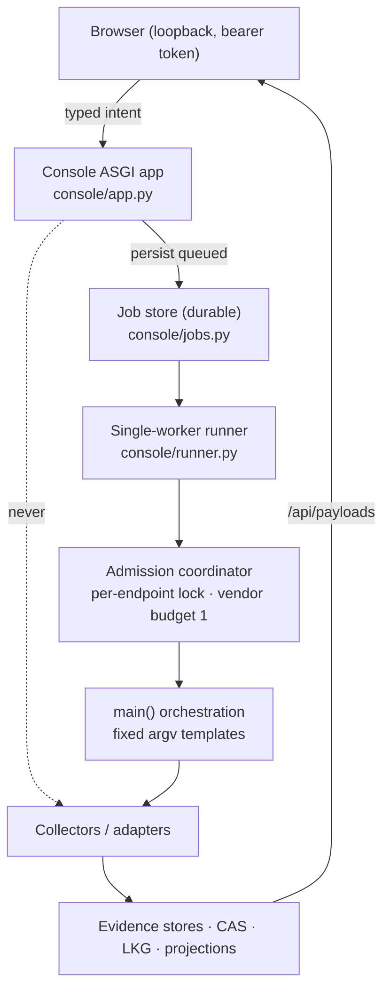
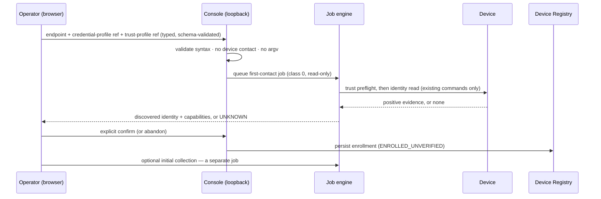

# Local control-plane runtime, storage and UI-first enrollment

## Status

**DRAFT — PRODUCT OWNER REVIEW REQUIRED.** Architecture and sequencing only.
It authorizes **no** code: no database, no migration, no enrollment endpoint,
no credential store, no collector change, no device contact, no production
wiring (`AGENTS.md` "Contract-status law").

| | |
| --- | --- |
| **Movement** | `ARCHITECTURE`, serving the roadmap row `pcp_2_local_control_plane_sequencing_po_review` |
| **Revision** | **2 — 2026-09-05.** Records the Product Owner's decisions on the enrollment write gate (§9), first-contact trust (§9.3), auto-enrollment (§9.4), storage sequencing (§6.4) and the movement order (§12); withdraws benchmark citations invalidated by the research appendix's §0.2 evidence correction. Still DRAFT |
| **Companion DRAFT** | `docs/design/NAVIGATION_INFORMATION_ARCHITECTURE.md` — navigation, entity workspace, capability-state presentation |
| **Design parent** | `docs/design/PRODUCT_CONTROL_PLANE_ARCHITECTURE.md` (`PCP.0`, FROZEN) — **not edited here.** Where an amendment would eventually be needed it is proposed with its trigger in §11 and **not applied** |
| **Preserves unchanged** | `CON.0` §3/§4/§6/§7/§9/§10; `OP.2.0` P1–P18; `RB.x` incl. `D3`/`D4`; `utils/action_taxonomy.py`; `PCP.1`'s frozen `PCP.0` §21 registry contract; the admission coordinator and the vendor budget of 1 |
| **Decides** | nothing. Every fork is listed in §13 for the Product Owner |

---

## 1. The operator experience being designed

The Product Owner's target, verbatim in intent:

> Enrol a device once. Keep the local console running. Select a registered
> device or logical entity. Ask for a collection or another typed job. Watch it
> queue, run, finish or fail. See the refreshed evidence. Later, give different
> devices and capabilities different schedules.

Normal product operation must not mean repeatedly starting `main.py`.

This is a **local, controlled development/pilot architecture**. It is not a
production deployment and must not be blocked merely because the production
server is unavailable — while equally, nothing here may quietly become
production authorization (§11).

---

## 2. What already exists — the honest baseline

The single most useful finding of this review: **most of the runtime the
Product Owner is asking for is already shipped.** The gap is narrower and more
specific than "we need a local control plane".

| Capability | Status today | Where |
| --- | --- | --- |
| Long-running local service | **SHIPPED** — `py main.py --console` runs a loopback ASGI app until stopped | `console/server.py::run_console` (uvicorn), `console/app.py` |
| Authenticated, cookieless local access | **SHIPPED** — per-launch bearer token in the URL fragment | `CON.0` §7.2, `console/auth.py` |
| Typed job submission from the browser | **SHIPPED** — `POST /api/jobs {job_type, targets[]}` against a closed source registry | `console/registry.py::JOB_REGISTRY`, `console/app.py` |
| Durable job records + lifecycle | **SHIPPED** — `queued → running → succeeded/failed/blocked/skipped`, audit-before-action | `console/jobs.py` |
| Live job state to the UI | **SHIPPED** — SSE over a bearer-authenticated `fetch` stream | `console/app.py`, `console_actions.js::_consoleWatchJob` |
| Single-worker execution through the one orchestration path | **SHIPPED** | `console/runner.py`, `utils/collection_executor.py` |
| Crash reconciliation | **SHIPPED** — orphaned `running` records swept to `failed`/`console_restarted` | `console/jobs.py::sweep_orphaned_running` |
| Persistent device registry | **SHIPPED (CLI only)** | `utils/device_registry.py`, `PCP.1` |
| Storage seam for a future engine | **SHIPPED** — eighth `evidence_backend` concern | `utils/evidence_backend.py::DeviceRegistryBackend` |
| Evidence refresh visible in the UI | **SHIPPED** — `/api/payloads` re-read + `initializeReport()` | `console_actions.js` |
| **Device-targeted collection** | **MISSING** | every collection job type is `target_mode="none"` — plane-wide by design |
| **Registry-keyed job targets** | **MISSING** — targets resolve against `unified.json` entity ids, not `device_id` | `CON.0` §4 |
| **Enrollment from the browser** | **MISSING and gated** | `pcp_console_registry_write_gate` |
| **Per-device / per-capability schedules** | **MISSING** | `data/state/scheduler_policy.json` is global and default-disabled |
| **Capability projection per device** | **MISSING** | `PCP.3` |

**Therefore the work is not "build a local control plane".** It is, in order:
(1) give collectors a target-selection seam; (2) key job targets on the
registry; (3) decide and add the enrollment path; (4) add per-device schedules.
Everything else is reuse.

---

## 3. Runtime shape

### 3.1 One service, no second console

`console/app.py` **never** contacts a device. It writes a `queued` record and
returns. This is `CON.0` §7.9 (audit before action) and is the rule that keeps
HTTP request handlers free of long-running device I/O.

### 3.2 Process lifecycle

| Property | Contract |
| --- | --- |
| Start | `py main.py --console [--console-port N]`; unchanged |
| Binding | `127.0.0.1` only; changing it is a `DEPLOY.1A`-class decision (`C-D5`), not a flag |
| Lifetime | runs until the operator stops it; **no daemonization, no service installer, no auto-start** in this architecture |
| Restart | on start, sweep orphaned `running` records to `failed`/`console_restarted`; never silently resume a device action |
| Single instance | one control-plane writer per RuntimeRoot (§6.5); a second instance must fail closed, not race |
| Scheduler | the console **is not** the scheduler process (`C5-2`); if a scheduled evaluator is later hosted in it, that is its own movement and its own gate |
| Shutdown | in-flight job marked `failed`/`console_restarted` on next start; **never** marked `succeeded` |

### 3.3 Report vs console

Unchanged from `CON.0` §1/§6 and the navigation DRAFT §12: the exported report
is a portable, action-free evidence artifact; the console is the only
interactive surface. **No second console is proposed anywhere in this
document.**

---

## 4. Background typed jobs

Rules, all of which the shipped engine already satisfies except where noted:

1. **No long-running device contact inside an HTTP request.** Submit → persist
   → return. The browser polls or streams.
2. **Durable lifecycle before execution.** `queued` reaches storage before the
   runner may start (`CON.0` §7.9).
3. **Execution through the existing runner and admission coordinator only.** One
   orchestration path; no second path (`CON.2` C2-2).
4. **Progress by polling or SSE**, carrying **state transitions only** — never
   collector output (`C2-10`).
5. **Auditable outcome + evidence reference.** Job records stay identity-lean:
   target reference, type, timing, outcome, run reference. No credential, no
   management address, no raw device output, no backup bytes (`CON.0` §7.8).
6. **Safe restart.** §3.2.
7. **Never turn an arbitrary command into a job payload.** The registry is a
   module-level constant reviewed as source (`CON.0` §4).
8. **Retry is a new job**, never a mutation of a historical outcome. A job-plane
   retry/backoff policy is class 0 only and is **never** inherited by
   `utils/operate/` (`PCP.0` §9; `OP.2` no-blind-retry).

---

## 5. Device-targeted execution

The central technical gap, and the place where a shortcut would be a real
safety regression.

| Rule | Consequence |
| --- | --- |
| Targets are **opaque `device_id`** (registry) or a canonical logical-entity id — never a hostname, address, credential or command | `CON.0` §4 preserved; identity law preserved |
| Endpoint, credential and trust are resolved **server-side, at the authorized execution stage** | nothing device-addressable crosses the wire |
| An unsupported target selection is **refused at admission, before any device is contacted** | fail-closed; the missing seam is the refusal reason |
| **A plane-wide run must never be relabelled as a device-targeted job** | running the whole plane and filtering the result contacts every device on the plane — including devices outside the requested set and devices the registry does not know — while an audit record naming only the requested ids would misrepresent it (`PCP.0` §9, verbatim) |
| Explicitly plane-wide workflows stay **honestly plane-wide** until they gain real target-selection seams | today that is every `target_mode="none"` job type |
| Aggregate contact per endpoint stays bounded by the admission coordinator and the vendor budget of 1 | per-device cadences must not multiply device contact |

**Current reality, stated plainly:** `JOB_REGISTRY` contains six `read`-class
types of which only `recovery_attest_cp` takes `entity_ids`; every inventory and
configuration refresh is `target_mode="none"`. Per-device collection therefore
**cannot** be offered honestly until the collector seams exist (`PCP.6`). Until
then the correct UI is "refresh this plane", not "refresh this device".

---

## 6. Storage — the SQLite question

### 6.1 Environment facts (availability, not selection)

Supplied by the Product Owner: `sqlite3` 3.45.3, `pytest` 9.1.1, `lxml` 6.1.2,
`paramiko` 4.0.0, `git` 2.47.1.windows.1, no local `gh` CLI (GitHub via the
configured MCP path). These prove SQLite is **available** locally. They do not
decide the engine — `pcp_storage_engine` is open and stays open (`PCP.0` §19).
For the record, 3.45.3 does provide everything §6.5 asks for (WAL, `STRICT`
tables, `RETURNING`, foreign-key enforcement, `busy_timeout`).

### 6.2 Options

- **A — Registry stays filesystem JSON; SQLite backs only new local
  control-plane metadata (job definitions, runs, schedules, capability
  projections).**
- **B — One governed storage movement migrates the registry *and* the job/
  control-plane metadata into SQLite.**
- **C — No SQLite yet; continue with filesystem concerns for another slice.**

### 6.3 Decision matrix

| Criterion | A (registry JSON + SQLite for new state) | B (migrate everything) | C (stay filesystem) |
| --- | --- | --- | --- |
| **Authority ownership** | registry authority unchanged (`PCP.1` §21); new state owned by the new store | one owner for all control-plane state — cleanest end-state | unchanged |
| **Reopens the frozen `PCP.1` contract?** | **No** | **Yes** — duplicate detection, lock semantics and fail-closed corrupt-data handling would all be re-expressed in SQL | No |
| **Migration complexity** | none for existing data; additive schema | real migration + rollback of live product state | none |
| **Transaction boundaries** | two atomicity domains (see §6.4 risk) | one transaction spans enrollment + relationships + jobs | file-level atomic replace only |
| **Duplicate protection** | registry keeps its validated in-process check | a `UNIQUE` index enforces it in the engine — structurally stronger | as today |
| **Concurrency** | registry: existing mutation lock; new state: one writer + WAL readers | one writer + WAL readers throughout | lock files everywhere |
| **Crash consistency** | registry: atomic replace (proven); new state: WAL | WAL throughout | atomic replace |
| **Schema versioning** | needed for the new store only | needed, and must version already-shipped data | none |
| **Backup / restore** | JSON file + DB file | one DB file | files |
| **Corruption handling** | registry fail-closed (shipped); DB fail-closed (to define) | one fail-closed path | shipped |
| **Testability** | temp dir + temp DB; existing registry tests untouched | existing registry tests rewritten | shipped |
| **Local dev ergonomics** | good; JSON registry stays hand-inspectable | good; needs a CLI/`sqlite3` to inspect | best |
| **Container / server migration** | the `evidence_backend` seam already allows a later engine swap | same | further from it |
| **Rollback** | drop the new DB; registry untouched | restore both from backup | trivial |
| **Privacy classification** | both LOCAL-SENSITIVE; both excluded from the support bundle | same | same |
| **Blast radius if wrong** | new state only | **all product state** | none, but the gap persists |

### 6.4 DECIDED — Option A approved for local sequencing

**The Product Owner approves Option A.** `PCP.1`'s Device Registry stays on its
frozen filesystem JSON backend; a new SQLite store owns **new local
control-plane metadata** only. The **production `pcp_storage_engine` decision
remains open.** *This is not approval to implement SQLite in this session* —
movement `M4` must be separately authorized.

**Ownership boundary — what SQLite may own once `M4` is authorized:**

- job definitions, **where they become durable data rather than source constants**;
- job / run lifecycle records;
- schedules;
- capability projections;
- idempotency and submission metadata;
- control-plane runtime metadata.

**What it must never own under this local option:**

- Device Registry rows;
- credential payloads;
- trust secrets;
- raw configuration;
- backup bytes;
- CAS evidence objects;
- `OP.2` action authority.

**Registry authority, stated as a rule.** The Device Registry remains
authoritative for enrollment and lifecycle **at job admission and again
immediately before execution**. If a target becomes disabled or unresolvable
between submission and execution, the job **must be refused or aborted before
any device contact, and must record the reason**. **SQLite must never retain a
copied endpoint as fallback authority** — a job carries an opaque reference, and
a reference that no longer resolves is a refusal, not a cache hit.

This is the mitigation for Option A's real cost: two atomicity domains. The cost
is accepted with these rules, not waved away.

**On replacing the registry backend later.** The `DeviceRegistryBackend` seam in
`utils/evidence_backend.py` preserves the *possibility* of moving the registry
to another engine. Revision 1 described that later move as "a backend
implementation, not a contract change". **That characterisation is withdrawn as
categorically wrong.** An abstract interface existing does not make a migration
free. A future migration must **prove semantic parity** for:

- endpoint normalization;
- duplicate handling;
- lifecycle transitions;
- concurrency;
- lock and transaction behaviour;
- corrupt / unsupported-state failure behaviour;
- migration rollback.

It would be a **governed storage movement** even though the abstract backend
interface already exists.

### 6.5 Required future SQLite contract (Option A approved; contract due at `M4`)

Architecture level; **no schema, no DDL, no code in this movement.**

| Concern | Contract |
| --- | --- |
| Location | under RuntimeRoot `data_root` (`utils/runtime_paths`), never in the repository, never in `output_root` |
| Connection ownership | owned by the control-plane process; **one writer**, readers may be concurrent |
| Journal mode | **WAL**, for one-writer/many-reader and better crash behaviour |
| Filesystem | **local filesystem only.** WAL requires shared memory and is unsafe on SMB/NFS; a network share is not supported unless a later contract explicitly proves it |
| `busy_timeout` | set explicitly (order 5 s); contention waits then fails closed — never an unbounded block |
| Foreign keys | `PRAGMA foreign_keys=ON` |
| Table strictness | `STRICT` tables (3.37+; 3.45.3 available) |
| Durability | `synchronous` chosen and justified with WAL; a job record must be durable before the runner may start it (`CON.0` §7.9) |
| Migrations | an explicit `schema_migrations` table, monotonic version, applied by a **deployment-controlled step**; runtime auto-create stays pre-production only (`DEV.4.6` precondition) |
| Unsupported / newer schema | **fail closed** — refuse to start, name the version, never auto-upgrade downward |
| Corruption | fail closed; never auto-repair; never silently recreate. Mirror `utils/device_registry.py`'s whole-document fail-closed posture |
| Uniqueness | at minimum: one active run per definition; idempotency key unique per job submission |
| Backup / restore | the DB is product state worth restoring; joins `recovery_offhost_key_custody` in the off-host custody question |
| Test isolation | a temp `data_root` per test; no shared global connection |
| Support bundle | **excluded**, like the registry and its lock file |
| Classification | LOCAL-SENSITIVE; contains device references and job history, never secrets |

---

## 7. Credential and trust references

**A local metadata store must never become an accidental secret vault.**

| Rule | Consequence |
| --- | --- |
| The browser submits an **opaque credential-profile reference** and a **trust-profile reference** — never a password, key, token or passphrase | no secret crosses the HTTP boundary |
| Registry and control-plane rows hold **references only**, format-validated, never resolved at write time (`PCP.1` behaviour, unchanged) | a stolen registry file yields no credential |
| Credential resolution happens **server-side, at the authorized execution stage**, exactly as `main.py` resolves today | one resolution path |
| Logs, job errors, UI payloads, exported reports and support bundles never carry secret material | existing redaction registry + support-bundle enumeration |
| **Trust is established before credentials are submitted** where the vendor transport requires it (SSH host key, TLS CA) | a mistyped or hostile endpoint never receives a credential — `pcp_first_contact_trust_policy` |
| No credential *management* product is designed here | out of scope, explicitly |

---

## 8. UI-first enrollment

### 8.1 The workflow

1. Operator enters a management endpoint.
2. Operator selects an **opaque credential profile**.
3. Operator selects or establishes a **trust profile**.
4. The console submits a **typed, auditable, read-only first-contact job**.
5. Vendor/identity derived **only from positive evidence**.
6. The result is **presented for review** — identity and capabilities.
7. The operator **explicitly confirms**.
8. The registry persists the enrollment.
9. Initial collection is **offered separately**, as its own job.

### 8.2 Identity rules — what may never decide vendor

Never from: port alone; banner alone; endpoint shape; an unverified operator
hint; trial-and-error credential spraying. The operator's vendor hint is a
**routing hint** recorded with a `classification_basis`, never identity
(`PCP.1`, `AGENTS.md` identity law).

**When evidence is missing, ambiguous or contradictory:** report `UNKNOWN` (or
the existing canonical equivalent), **persist no enrolled device**, and keep
only the permitted job/evidence record. A failed first contact must not leave a
phantom device (`PCP.0` §1 "no phantom devices").

### 8.3 Where "Add Device" lives

Never a navigation root (navigation DRAFT D-NAV5). Candidates evaluated:

| Location | For | Against |
| --- | --- | --- |
| Devices / entity-list pane header | matches operator intent ("I am looking at my fleet, add one") | can imply enrollment is casual — answered by the confirmation and audit conditions in §9 |
| Administration → Device Management | matches lifecycle intent; externally supported — FireMon onboards under `Administration → Device → Devices` (appendix §4, URL-STRUCTURE). Revision 1 also cited an AlgoSec pane-header control; **that observation is withdrawn** (appendix §0.2) | far from where the operator notices the gap |
| Configuration → Device management | — | **Rejected.** Configuration is a *plane*, not a device-lifecycle owner |

**DECIDED — `PO-NAV-1`, the combined pattern.** The **Devices / entity-list
pane header** carries the primary operator affordance;
**Administration → Device Management** is the lifecycle home for listing,
disabling, re-verifying and later managing profile references. Both entry
points invoke **one enrollment contract** — no duplicate implementation — and
**Configuration does not own device lifecycle**.

---

## 9. Enrollment, trust and auto-enrollment — Product Owner decisions

### 9.1 `pcp_console_registry_write_gate` — APPROVED FOR A FUTURE LOCAL-CONTROLLED IMPLEMENTATION

**Not implemented here, and not implemented by this movement.** The Product
Owner chose the conditioned local-loopback option.

Both **manual endpoint enrollment** and **candidate-based enrollment** may
eventually write through the local loopback Operator Console **before
`DEPLOY.1A`** — but **only when every one of the following is implemented**:

1. loopback binding only;
2. per-launch authenticated console access;
3. a **closed typed enrollment intent**;
4. a strict request schema;
5. **no command or argv input** of any kind;
6. **credential-profile reference only**;
7. **trust-profile reference only**;
8. **no credential payload from the browser**;
9. **no device contact inside the HTTP request**;
10. first contact executed as a **queued, read-only typed job**;
11. **positive-evidence** identity classification;
12. an explicit **identity preview**;
13. explicit **operator confirmation**;
14. an **immutable audit record written before** the registry mutation;
15. the **same `DeviceRegistry` enrollment path as the CLI** — one implementation;
16. **server-side duplicate detection and lock contract**;
17. **production/server mode refuses this local permission** unless `DEPLOY.1A`
    independently authorizes it.

**A closed candidate id narrows the target. It does not remove confirmation,
audit or trust requirements, and it does not independently grant write
authority.** The two enrollment intents are therefore held to the same bar.

Movement **`M9`** owns the implementation; movement `M8` must land first
because condition 10/11 depend on it.

### 9.2 Required future amendments — recorded, not applied

These are the exact amendments the decision above will require. **None is
applied while this architecture remains DRAFT.**

| # | Document | Amendment | Trigger |
| --- | --- | --- | --- |
| A1 | `CON.0` §4 (intent boundary) | A narrow, explicit carve-out for a **typed, schema-validated enrollment intent**: §4's "the browser never transmits … a hostname, an address" remains true for **command construction**, and enrollment is named as a distinct bounded intent that contacts no device in that request, constructs no argv, and is audited before persistence. The carve-out is conditioned on the **loopback binding**, so it does not survive into server mode | start of `M9` |
| A2 | `CON.0` §7 (security model) | Add the seventeen conditions of §9.1 as the enrollment intent's own hard rules, in the same form as the existing numbered rules | start of `M9` |
| A3 | `PCP.0` §19 | Record `pcp_console_registry_write_gate` as decided-in-direction (conditioned local-loopback), and `pcp_first_contact_trust_policy` and `pcp_auto_enrollment_policy` per §9.3 and §9.4 | when this DRAFT is frozen |
| A4 | `PCP.0` §20 | Re-sequence to record the local control-plane runtime/storage work as a movement distinct from `PCP.2`'s enrollment providers (§12) | when this DRAFT is frozen |
| A5 | `PCP.0` §9 | Record the schedule/capability-policy state concept in the **schedule/capability-policy contract**, explicitly **not** in the job lifecycle vocabulary | `M3` / `M12` |
| A6 | `PCP.0` §8 | Record the registry/evidence reconciliation state concept in the **reconciliation projection**, explicitly not as a generic capability state | `M3` / `M10` |

### 9.3 `pcp_first_contact_trust_policy` — APPROVED IN DIRECTION

**Strict transport trust is required before credentials are submitted to every
endpoint — including management-plane candidates.** There is no candidate
exemption.

- Candidate provenance **may supply or select an approved trust profile**.
- Candidate provenance **may not waive** SSH host-key or TLS trust.
- **Prohibited:** TOFU (trust on first use), automatic trust acceptance,
  certificate verification bypass, and credential-first probing.
- Movement **`M8`** must define the approved trust-establishment mechanisms for
  Check Point and Palo Alto **using the existing transport seams**
  (`utils/cp_ssh_trust.py`, `utils/pan_tls_trust.py`) — not a new credential or
  network path (`AGENTS.md` diagnostic-path law).

The rule this protects: a mistyped or hostile endpoint must never receive a
credential.

### 9.4 `pcp_auto_enrollment_policy` — NOT APPROVED FOR THE CURRENT HORIZON

Manual endpoints and discovered candidates **both** require:

- positive identity evidence;
- operator preview;
- explicit confirmation.

**No discovery source may automatically create a persistent enrolled device.**

Auto-enrollment remains a **separately gated future capability requiring a new
Product Owner decision**. "Not now" is explicitly **not** a permanent
prohibition — it is a decision deferred until real candidate volume exists to
reason about (`PCP.0` §19).

---

## 10. Collection, scheduling and progressive menus

### 10.1 The progression after enrollment

Each item is a later movement, not a design to build now:

- collect now, for one device/logical entity (**needs `PCP.6` seams**);
- select an approved collection profile (closed vocabulary);
- watch job progress (**shipped**);
- review evidence freshness and failures (**mostly shipped**);
- configure different schedules per device/capability;
- leave a capability unscheduled; disable a schedule **without disabling the
  device** (the proposed `POLICY_DISABLED` state);
- retry as a **new typed job**, never by mutating a historical outcome;
- distinguish **manual**, **scheduled**, **console** and system-reconciliation
  provenance (`C-D3` already added `console`).

### 10.2 Where schedules live

Externally supported: FireMon puts `Enable Scheduled Retrieval` **on the
device** with its own interval, alongside a separate **Manual Retrieval**
action (appendix §4, DOC-EXCERPT). Revision 1 also cited BackBox shipping
`Schedules` as its own root with sibling Operations children; **that
observation is withdrawn** (appendix §0.2). The sibling shape survives instead
as a **Product Owner decision** — `PO-NAV-8` places `Jobs`, `Schedules`,
`Queue` and `History` under Operations — not as benchmark evidence.

| Ownership | Assessment |
| --- | --- |
| The **selected device capability** | where an operator forms the intent ("this device, more often"). **Recommended primary** |
| A **global Schedules view** under Operations | where an operator audits the whole cadence at once. **Recommended secondary**, read-first |
| Jobs | conflates a definition with its executions |
| Administration | too far from the device |
| Navigation state | **rejected outright** — a schedule is durable product state, never a UI preference. Navigation must never carry it |

**Recommendation:** schedules are a **property of the device capability**,
edited where the capability lives, and **viewed** in a global Operations →
Schedules surface. Editing scheduler policy from a browser remains gated by
`C-D7`; the `>= 10 min` floor and default-disabled posture are unchanged.

### 10.3 Progressive menus without fake capability

A capability appears when its contract ships (navigation DRAFT §7 P1). Stable
orientation is preserved by the reserved-domain list: the *place* a future
capability will occupy is written down, so its arrival does not re-arrange the
operator's map. **No "coming soon" entry is ever rendered.**

---

## 11. Security and authority review, and proposed amendments

### 11.1 Review

| Property | Status |
| --- | --- |
| No mutation authority granted by navigation | held (navigation DRAFT §15) |
| DOM presence never equals authorization | held |
| No credential payload in browser, registry, SQLite, logs or bundles | held (§7) |
| No device I/O in a request handler | held (§3.1, §4.1) |
| No vendor identity without positive evidence | held (§8.2) |
| No device targeting via fleet-wide execution + post-filter | held (§5) — the explicit refusal is the point |
| `CLASS 2` / `OP.2` authorization, readiness, locking unweakened | held — nothing here touches `utils/operate/` or `utils/failover/` |
| No raw secret-bearing configuration exposed | held (navigation DRAFT §10) |
| Local pilot exemption never becomes production authorization | **RISK R-1**, §11.3 |
| No second console, registry, readiness engine or identity authority | held (§3.3) |
| Stale UI state never authorizes a job | held (§6.4 mitigations, `OP.2.0` P4/P14) |
| Hidden navigation is not a security boundary | held |

### 11.2 Proposed amendments — listed, **not applied**

The full list, with triggers, is **§9.2** (`A1`…`A6`). It is maintained there so
the enrollment decision and the amendments it forces stay together. **None is
applied while this architecture remains DRAFT**, and no frozen document is
edited by this movement.

### 11.3 R-1 — the local-pilot exemption risk

The Product Owner has now approved the conditioned local-loopback direction
(§9.1), which makes this risk live rather than hypothetical. A permission
granted for a **loopback, single-operator, audited local profile** must not
silently become the production posture when `CON.6`/`DEPLOY.1` arrives.

**Mitigation, binding on `M9`:** condition 17 of §9.1 and amendment `A1` both
tie the permission to the **loopback binding itself**, so server mode re-asks
the question rather than inheriting the answer. `M14` (production OIDC/RBAC)
**does not retroactively validate** any local shortcut taken before it.

---

## 12. Proposed bounded movement sequence

Each is one objective, small enough for a normal-reasoning implementation
prompt. **None is authorized by this document.** The order below reorders the
Product Owner's draft list where repository evidence shows a safer dependency.

| # | Movement | Objective | User-visible outcome | Primary files / seams | Security invariant | Prerequisites | Non-goals | Validation | Tier | New session? |
| --- | --- | --- | --- | --- | --- | --- | --- | --- | --- | --- |
| **M0** | **PO review of these two DRAFTs** — **still open**; review round 1 and this correction are both part of it | Close direction (done, §13.1) then freeze the contracts | none | the two DRAFTs + the research appendix | — | — | no code | doc/state checks | extended (PO-facing) | in progress |
| **M1** | **`PCP.1` uuid test-contract repair** | Fix the two deterministic failures on `main` | none | `tests/test_pcp1_device_registry.py` (and only if needed `utils/device_registry.py`) | the AC being proven must not weaken | none — **independent of NAV**; branches from **current `main`**, not from this branch | no registry behaviour change; no navigation or architecture change | targeted + full suite | normal | **yes** |
| **M2** | **Navigation accessibility closure** | Close the four named gaps (nav DRAFT §13.1) | better keyboard/AT/reduced-motion behaviour | `navigation_ui.js`, `style.css` | none touched | M0 approves the rail | no IA change | targeted + both harnesses | normal | no |
| **M3** | **Capability-state vocabulary + presentation contract** | Map the ten UX semantics onto canonical states; settle the two `PO-NAV-7` concepts in their **correct owning domains**; own the `PO-NAV-6` colour/label contract | none | a contract doc + `docs/ARCHITECTURE.md` | **must not** alter the job lifecycle vocabulary | M0 | no UI, no payload | state/doc checks | extended (vocabulary) | maybe |
| **M4** | **Local control-plane metadata store** | Option A, additively (§6.4 boundary) | none | new `evidence_backend` concern(s), RuntimeRoot | fail-closed corruption/version; excluded from bundle; **never owns registry rows, credentials, trust, raw config, backup bytes, CAS or `OP.2` authority** | §6.4 approved; separate authorization to start | **no registry migration**; no job schema yet | targeted + privacy gate | extended (storage) | **yes** |
| **M5** | **Collector target-selection seam — one collector** | Give exactly one collector a registry-derived target set (`PCP.6`, narrowed) | none yet | one collector + `collection_executor` | no plane-wide-then-filter; contact not multiplied | M4 (or none, if seams land first) | not all collectors at once | targeted + subsystem regression | extended (first), normal (rest) | yes |
| **M6** | **Registry-keyed job targets** | `device_id` targets resolved against the registry at admission | job targets name real enrolled devices | `console/registry.py`, `console/app.py`, `console/runner.py` | unsupported targeting refused before contact | M4, M5 | no new job types | targeted + console tests | normal | no |
| **M7** | **Device-targeted collection job** | One typed per-device collection job, end to end | "collect now" for one device | job type + runner + UI affordance | class 0 only; admission unchanged | M5, M6 | no schedules | targeted + console + render harness | normal | no |
| **M8** | **First-contact trust + identity resolution** | The read-only first-contact job and its trust preflight | identity/capability preview | `pcp_first_contact_trust_policy`, existing identity reads | trust before credential; UNKNOWN persists nothing | M6; the trust-policy decision | no enrollment write | targeted + real-env for trust | extended (trust) | yes |
| **M9** | **Enrollment preview + confirmation (UI)** | §8's flow under §9.1's seventeen conditions | add a device from the console | console routes + `DeviceRegistry.enroll` | all seventeen §9.1 conditions; amendments `A1`/`A2` applied first | M8; amendments `A1`/`A2` | no credential management; no production exposure | targeted + security review | extended (gate) | yes |
| **M10** | **Capability projection per device** | `PCP.3` | modules light up per device honestly | `utils/capability_registry.py` + projection | capability ≠ readiness ≠ authorization | M6 | no UI redesign | targeted | normal | no |
| **M11** | **Shared entity workspace context** | One selected entity across modules (nav DRAFT §6.3) | one selection, many views | `navigation_ui.js`, module renderers | no second identity authority | M10 | no new evidence | targeted + harnesses | normal | no |
| **M12** | **Per-device / per-capability schedules** | §10.2 | different cadences per device | job definitions + scheduler policy | ≥10 min floor; default-disabled; `C-D7` for editing | M7, M10 | no new collectors | targeted + subsystem | extended (contract) | yes |
| **M13** | **Recovery domain promotion** | `PO-NAV-2`, once `RB.5`/`CON.4` surfaces exist | Recovery root | recovery payloads + nav model | no recovery bytes over HTTP | `RB.4`/`RB.5` | no restore workflow | targeted + harnesses | normal | no |
| **M14** | **Production OIDC/RBAC integration** | `DEPLOY.1A` | real authorization | out of scope here | P4 additive; never a nav proxy | `DEPLOY.1` external | everything else | full | extended | yes |

### 12.1 Product Owner clarifications on the sequence (adopted)

The `M1`…`M14` sequence is **adopted** with these corrections. **No movement is
authorized or begun by this document.**

| Movement | Clarification |
| --- | --- |
| **`M0`** | The current architecture correction **is part of `M0`**. `M0` is not closed by it |
| **`M1`** | A **new session** and a **clean, narrow PR from current `main`** — it repairs the two `PCP.1` test-contract failures **independently of NAV**. It must not carry navigation or architecture changes |
| *(after `M1` merges)* | The NAV/`PCP.2` branch **must incorporate the new `main` safely** before later validation or any PR |
| **`M2`** | **Required before the NAV prototype can merge** (§ navigation DRAFT 13.1 gate table). Not a freeze blocker |
| **`M3`** | Owns the **domain-specific status vocabulary and the colour/presentation contract**. It **must not modify the job lifecycle vocabulary** incorrectly — the schedule/capability-policy concept never joins `queued`/`running`/`succeeded`/`failed`/`blocked`/`skipped` (`PO-NAV-7`) |
| **`M4`** | Implements **local SQLite control-plane metadata only**, per approved Option A and the §6.4 ownership boundary |
| **`M5`** | Remains the **first real collector target-selection seam** and the **critical path** for honest per-device collection |
| **`M6`** | Resolves **registry-keyed targets at admission and again at execution** (§6.4) |
| **`M7`** | Delivers **one real device-targeted "collect now" path** |
| **`M8`** | Owns **strict first-contact trust** (§9.3) and evidence-based identity resolution |
| **`M9`** | Owns **enrollment preview/confirmation** and the approved **local-loopback write boundary** (§9.1's seventeen conditions, amendments `A1`/`A2`) |
| **`M10` / `M11`** | **Default remains two separate movements.** They may be re-evaluated together **only** if capability projection and shared workspace context cannot be separated safely |
| **`M12`** | Owns **per-device / per-capability schedules** |
| **`M13`** | Promotes **Recovery only when `PO-NAV-2`'s surface trigger is met** |
| **`M14`** | Production OIDC/RBAC. It **does not retroactively validate local shortcuts** (§11.3) |

**Dependency note:** `M1` and `M2` are independent of the chain and can run at
any time; `M1` runs from `main`, not from this branch. `M5` is the critical
path — nothing device-targeted is honest before it.

**Reuse, not rebuild:** `PCP.1` registry, the existing console and job engine,
the admission coordinator, existing collectors/adapters, existing evidence
projections, the uitest render fixtures, and the validated CP ClusterXL / VSX /
PAN HA semantics are all inputs to this sequence, never things it replaces.

---

## 13. Decision status after the review

### 13.1 Closed in direction by this review

| Decision | Outcome | Where |
| --- | --- | --- |
| `pcp_console_registry_write_gate` | **Conditioned local-loopback approved** for a future implementation; seventeen mandatory conditions; production blocked on `DEPLOY.1A` | §9.1 |
| `pcp_first_contact_trust_policy` | **Approved in direction** — strict transport trust before credentials for **every** endpoint, candidates included; no TOFU/auto-accept/bypass/credential-first probing | §9.3 |
| `pcp_auto_enrollment_policy` | **Not approved for the current horizon**; positive evidence + preview + confirmation always; no auto-created enrolled device; separately gated later | §9.4 |
| Local storage sequencing | **Option A approved**, with the ownership boundary and registry-authority rules | §6.4 |
| Enrollment location | **Combined pattern approved** (`PO-NAV-1`) | §8.3 |
| Movement order | **`M1`…`M14` adopted** with the §12.1 clarifications | §12.1 |
| Schedule ownership | Property of the device capability; global Operations view secondary | §10.2 |

### 13.2 Still open

| Question | Owner / gate |
| --- | --- |
| **Exact SQLite schema and migration implementation contract** | movement `M4` |
| **Exact Check Point / Palo Alto trust-profile mechanics** | movement `M8` |
| **Exact enrollment request / preview / confirmation schemas** | movement `M9` |
| **Production storage engine** (`pcp_storage_engine`) | remains open; `DEV.4.6` migrations/roles |
| **Production OIDC/RBAC** | `DEPLOY.1` / `DEPLOY.1A`, external |
| **Future auto-enrollment**, if ever proposed | a new Product Owner decision |
| **Raw privileged configuration access** | a separate future security decision (navigation DRAFT §10c) |
| **Sanitized exported job-history field schema** | `PCP.5` |
| **Future Jobs root promotion** | reopen only if later evidence justifies it; not pre-approved |

---

## 14. Non-goals

No database, schema, migration or DDL. No enrollment endpoint or route. No
credential store or credential-management product. No collector change or
targeting. No device contact. No scheduler change. No capability payload state.
No accessibility implementation. No repair of the `PCP.1` uuid tests. No
RBAC/OIDC. No second console. No `CLASS 2` movement. **No edit to any frozen
document** — the §9.2 amendments are recorded and unapplied. **No freeze, no
merge, no pull request**, and **no movement authorized or begun**.
