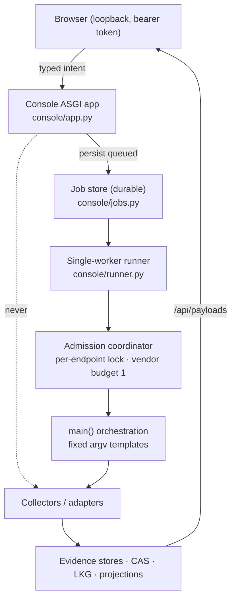
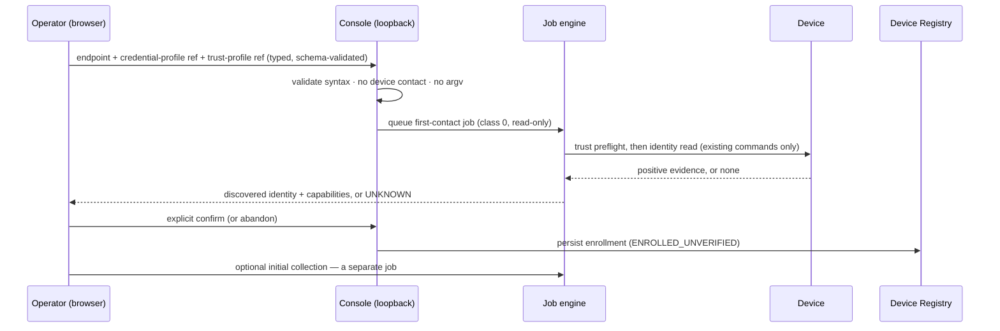

# Local control-plane runtime, storage and UI-first enrollment

## Status

**DRAFT — PRODUCT OWNER REVIEW REQUIRED.** Architecture and sequencing only.
It authorizes **no** code: no database, no migration, no enrollment endpoint,
no credential store, no collector change, no device contact, no production
wiring (`AGENTS.md` "Contract-status law").

| | |
| --- | --- |
| **Movement** | `ARCHITECTURE`, serving the roadmap row `pcp_2_local_control_plane_sequencing_po_review` |
| **Companion DRAFT** | `docs/design/NAVIGATION_INFORMATION_ARCHITECTURE.md` — navigation, entity workspace, capability-state presentation |
| **Design parent** | `docs/design/PRODUCT_CONTROL_PLANE_ARCHITECTURE.md` (`PCP.0`, FROZEN) — **not edited here.** Where an amendment would eventually be needed it is proposed with its trigger in §11 and **not applied** |
| **Preserves unchanged** | `CON.0` §3/§4/§6/§7/§9/§10; `OP.2.0` P1–P18; `RB.x` incl. `D3`/`D4`; `utils/action_taxonomy.py`; `PCP.1`'s frozen `PCP.0` §21 registry contract; the admission coordinator and the vendor budget of 1 |
| **Decides** | nothing. Every fork is listed in §13 for the Product Owner |

---

## 1. The operator experience being designed

The Product Owner's target, verbatim in intent:

> Enrol a device once. Keep the local console running. Select a registered
> device or logical entity. Ask for a collection or another typed job. Watch it
> queue, run, finish or fail. See the refreshed evidence. Later, give different
> devices and capabilities different schedules.

Normal product operation must not mean repeatedly starting `main.py`.

This is a **local, controlled development/pilot architecture**. It is not a
production deployment and must not be blocked merely because the production
server is unavailable — while equally, nothing here may quietly become
production authorization (§11).

---

## 2. What already exists — the honest baseline

The single most useful finding of this review: **most of the runtime the
Product Owner is asking for is already shipped.** The gap is narrower and more
specific than "we need a local control plane".

| Capability | Status today | Where |
| --- | --- | --- |
| Long-running local service | **SHIPPED** — `py main.py --console` runs a loopback ASGI app until stopped | `console/server.py::run_console` (uvicorn), `console/app.py` |
| Authenticated, cookieless local access | **SHIPPED** — per-launch bearer token in the URL fragment | `CON.0` §7.2, `console/auth.py` |
| Typed job submission from the browser | **SHIPPED** — `POST /api/jobs {job_type, targets[]}` against a closed source registry | `console/registry.py::JOB_REGISTRY`, `console/app.py` |
| Durable job records + lifecycle | **SHIPPED** — `queued → running → succeeded/failed/blocked/skipped`, audit-before-action | `console/jobs.py` |
| Live job state to the UI | **SHIPPED** — SSE over a bearer-authenticated `fetch` stream | `console/app.py`, `console_actions.js::_consoleWatchJob` |
| Single-worker execution through the one orchestration path | **SHIPPED** | `console/runner.py`, `utils/collection_executor.py` |
| Crash reconciliation | **SHIPPED** — orphaned `running` records swept to `failed`/`console_restarted` | `console/jobs.py::sweep_orphaned_running` |
| Persistent device registry | **SHIPPED (CLI only)** | `utils/device_registry.py`, `PCP.1` |
| Storage seam for a future engine | **SHIPPED** — eighth `evidence_backend` concern | `utils/evidence_backend.py::DeviceRegistryBackend` |
| Evidence refresh visible in the UI | **SHIPPED** — `/api/payloads` re-read + `initializeReport()` | `console_actions.js` |
| **Device-targeted collection** | **MISSING** | every collection job type is `target_mode="none"` — plane-wide by design |
| **Registry-keyed job targets** | **MISSING** — targets resolve against `unified.json` entity ids, not `device_id` | `CON.0` §4 |
| **Enrollment from the browser** | **MISSING and gated** | `pcp_console_registry_write_gate` |
| **Per-device / per-capability schedules** | **MISSING** | `data/state/scheduler_policy.json` is global and default-disabled |
| **Capability projection per device** | **MISSING** | `PCP.3` |

**Therefore the work is not "build a local control plane".** It is, in order:
(1) give collectors a target-selection seam; (2) key job targets on the
registry; (3) decide and add the enrollment path; (4) add per-device schedules.
Everything else is reuse.

---

## 3. Runtime shape

### 3.1 One service, no second console

`console/app.py` **never** contacts a device. It writes a `queued` record and
returns. This is `CON.0` §7.9 (audit before action) and is the rule that keeps
HTTP request handlers free of long-running device I/O.

### 3.2 Process lifecycle

| Property | Contract |
| --- | --- |
| Start | `py main.py --console [--console-port N]`; unchanged |
| Binding | `127.0.0.1` only; changing it is a `DEPLOY.1A`-class decision (`C-D5`), not a flag |
| Lifetime | runs until the operator stops it; **no daemonization, no service installer, no auto-start** in this architecture |
| Restart | on start, sweep orphaned `running` records to `failed`/`console_restarted`; never silently resume a device action |
| Single instance | one control-plane writer per RuntimeRoot (§6.5); a second instance must fail closed, not race |
| Scheduler | the console **is not** the scheduler process (`C5-2`); if a scheduled evaluator is later hosted in it, that is its own movement and its own gate |
| Shutdown | in-flight job marked `failed`/`console_restarted` on next start; **never** marked `succeeded` |

### 3.3 Report vs console

Unchanged from `CON.0` §1/§6 and the navigation DRAFT §12: the exported report
is a portable, action-free evidence artifact; the console is the only
interactive surface. **No second console is proposed anywhere in this
document.**

---

## 4. Background typed jobs

Rules, all of which the shipped engine already satisfies except where noted:

1. **No long-running device contact inside an HTTP request.** Submit → persist
   → return. The browser polls or streams.
2. **Durable lifecycle before execution.** `queued` reaches storage before the
   runner may start (`CON.0` §7.9).
3. **Execution through the existing runner and admission coordinator only.** One
   orchestration path; no second path (`CON.2` C2-2).
4. **Progress by polling or SSE**, carrying **state transitions only** — never
   collector output (`C2-10`).
5. **Auditable outcome + evidence reference.** Job records stay identity-lean:
   target reference, type, timing, outcome, run reference. No credential, no
   management address, no raw device output, no backup bytes (`CON.0` §7.8).
6. **Safe restart.** §3.2.
7. **Never turn an arbitrary command into a job payload.** The registry is a
   module-level constant reviewed as source (`CON.0` §4).
8. **Retry is a new job**, never a mutation of a historical outcome. A job-plane
   retry/backoff policy is class 0 only and is **never** inherited by
   `utils/operate/` (`PCP.0` §9; `OP.2` no-blind-retry).

---

## 5. Device-targeted execution

The central technical gap, and the place where a shortcut would be a real
safety regression.

| Rule | Consequence |
| --- | --- |
| Targets are **opaque `device_id`** (registry) or a canonical logical-entity id — never a hostname, address, credential or command | `CON.0` §4 preserved; identity law preserved |
| Endpoint, credential and trust are resolved **server-side, at the authorized execution stage** | nothing device-addressable crosses the wire |
| An unsupported target selection is **refused at admission, before any device is contacted** | fail-closed; the missing seam is the refusal reason |
| **A plane-wide run must never be relabelled as a device-targeted job** | running the whole plane and filtering the result contacts every device on the plane — including devices outside the requested set and devices the registry does not know — while an audit record naming only the requested ids would misrepresent it (`PCP.0` §9, verbatim) |
| Explicitly plane-wide workflows stay **honestly plane-wide** until they gain real target-selection seams | today that is every `target_mode="none"` job type |
| Aggregate contact per endpoint stays bounded by the admission coordinator and the vendor budget of 1 | per-device cadences must not multiply device contact |

**Current reality, stated plainly:** `JOB_REGISTRY` contains six `read`-class
types of which only `recovery_attest_cp` takes `entity_ids`; every inventory and
configuration refresh is `target_mode="none"`. Per-device collection therefore
**cannot** be offered honestly until the collector seams exist (`PCP.6`). Until
then the correct UI is "refresh this plane", not "refresh this device".

---

## 6. Storage — the SQLite question

### 6.1 Environment facts (availability, not selection)

Supplied by the Product Owner: `sqlite3` 3.45.3, `pytest` 9.1.1, `lxml` 6.1.2,
`paramiko` 4.0.0, `git` 2.47.1.windows.1, no local `gh` CLI (GitHub via the
configured MCP path). These prove SQLite is **available** locally. They do not
decide the engine — `pcp_storage_engine` is open and stays open (`PCP.0` §19).
For the record, 3.45.3 does provide everything §6.5 asks for (WAL, `STRICT`
tables, `RETURNING`, foreign-key enforcement, `busy_timeout`).

### 6.2 Options

- **A — Registry stays filesystem JSON; SQLite backs only new local
  control-plane metadata (job definitions, runs, schedules, capability
  projections).**
- **B — One governed storage movement migrates the registry *and* the job/
  control-plane metadata into SQLite.**
- **C — No SQLite yet; continue with filesystem concerns for another slice.**

### 6.3 Decision matrix

| Criterion | A (registry JSON + SQLite for new state) | B (migrate everything) | C (stay filesystem) |
| --- | --- | --- | --- |
| **Authority ownership** | registry authority unchanged (`PCP.1` §21); new state owned by the new store | one owner for all control-plane state — cleanest end-state | unchanged |
| **Reopens the frozen `PCP.1` contract?** | **No** | **Yes** — duplicate detection, lock semantics and fail-closed corrupt-data handling would all be re-expressed in SQL | No |
| **Migration complexity** | none for existing data; additive schema | real migration + rollback of live product state | none |
| **Transaction boundaries** | two atomicity domains (see §6.4 risk) | one transaction spans enrollment + relationships + jobs | file-level atomic replace only |
| **Duplicate protection** | registry keeps its validated in-process check | a `UNIQUE` index enforces it in the engine — structurally stronger | as today |
| **Concurrency** | registry: existing mutation lock; new state: one writer + WAL readers | one writer + WAL readers throughout | lock files everywhere |
| **Crash consistency** | registry: atomic replace (proven); new state: WAL | WAL throughout | atomic replace |
| **Schema versioning** | needed for the new store only | needed, and must version already-shipped data | none |
| **Backup / restore** | JSON file + DB file | one DB file | files |
| **Corruption handling** | registry fail-closed (shipped); DB fail-closed (to define) | one fail-closed path | shipped |
| **Testability** | temp dir + temp DB; existing registry tests untouched | existing registry tests rewritten | shipped |
| **Local dev ergonomics** | good; JSON registry stays hand-inspectable | good; needs a CLI/`sqlite3` to inspect | best |
| **Container / server migration** | the `evidence_backend` seam already allows a later engine swap | same | further from it |
| **Rollback** | drop the new DB; registry untouched | restore both from backup | trivial |
| **Privacy classification** | both LOCAL-SENSITIVE; both excluded from the support bundle | same | same |
| **Blast radius if wrong** | new state only | **all product state** | none, but the gap persists |

### 6.4 Recommendation — **A**, with its risk stated

**Recommend A**, sequenced so that B stays available later.

Reasons: it does not reopen a frozen, validated contract; it puts the new
engine where the new requirements actually are (job runs, schedules, history —
append-heavy, query-shaped work that JSON files serve badly); the registry's
existing behaviour is already proven; and the `DeviceRegistryBackend` seam means
a later move to B is a **backend implementation**, not a contract change.

**The honest cost of A:** two atomicity domains. A job run in SQLite can
reference a `device_id` whose registry row was concurrently disabled.
Mitigations, all fail-closed: the **registry is the authority at admission
time** and is re-read when a job starts; job records store an opaque reference,
never a copy of registry fields; a job whose target no longer resolves to an
enrolled, enabled device is **refused or aborted**, never run against a stale
copy. If the Product Owner judges that cost too high, **B is the coherent
alternative** and should be taken as one governed movement — never as a drift.

**`pcp_storage_engine` remains OPEN.** A confines SQLite to *new* local
control-plane state and therefore does **not** pre-empt the production engine
decision, which `PCP.0` §10 ties to `DEV.4.6` migrations/roles.

### 6.5 Required future SQLite contract (only if A or B is approved)

Architecture level; **no schema, no DDL, no code in this movement.**

| Concern | Contract |
| --- | --- |
| Location | under RuntimeRoot `data_root` (`utils/runtime_paths`), never in the repository, never in `output_root` |
| Connection ownership | owned by the control-plane process; **one writer**, readers may be concurrent |
| Journal mode | **WAL**, for one-writer/many-reader and better crash behaviour |
| Filesystem | **local filesystem only.** WAL requires shared memory and is unsafe on SMB/NFS; a network share is not supported unless a later contract explicitly proves it |
| `busy_timeout` | set explicitly (order 5 s); contention waits then fails closed — never an unbounded block |
| Foreign keys | `PRAGMA foreign_keys=ON` |
| Table strictness | `STRICT` tables (3.37+; 3.45.3 available) |
| Durability | `synchronous` chosen and justified with WAL; a job record must be durable before the runner may start it (`CON.0` §7.9) |
| Migrations | an explicit `schema_migrations` table, monotonic version, applied by a **deployment-controlled step**; runtime auto-create stays pre-production only (`DEV.4.6` precondition) |
| Unsupported / newer schema | **fail closed** — refuse to start, name the version, never auto-upgrade downward |
| Corruption | fail closed; never auto-repair; never silently recreate. Mirror `utils/device_registry.py`'s whole-document fail-closed posture |
| Uniqueness | at minimum: one active run per definition; idempotency key unique per job submission |
| Backup / restore | the DB is product state worth restoring; joins `recovery_offhost_key_custody` in the off-host custody question |
| Test isolation | a temp `data_root` per test; no shared global connection |
| Support bundle | **excluded**, like the registry and its lock file |
| Classification | LOCAL-SENSITIVE; contains device references and job history, never secrets |

---

## 7. Credential and trust references

**A local metadata store must never become an accidental secret vault.**

| Rule | Consequence |
| --- | --- |
| The browser submits an **opaque credential-profile reference** and a **trust-profile reference** — never a password, key, token or passphrase | no secret crosses the HTTP boundary |
| Registry and control-plane rows hold **references only**, format-validated, never resolved at write time (`PCP.1` behaviour, unchanged) | a stolen registry file yields no credential |
| Credential resolution happens **server-side, at the authorized execution stage**, exactly as `main.py` resolves today | one resolution path |
| Logs, job errors, UI payloads, exported reports and support bundles never carry secret material | existing redaction registry + support-bundle enumeration |
| **Trust is established before credentials are submitted** where the vendor transport requires it (SSH host key, TLS CA) | a mistyped or hostile endpoint never receives a credential — `pcp_first_contact_trust_policy` |
| No credential *management* product is designed here | out of scope, explicitly |

---

## 8. UI-first enrollment

### 8.1 The workflow

1. Operator enters a management endpoint.
2. Operator selects an **opaque credential profile**.
3. Operator selects or establishes a **trust profile**.
4. The console submits a **typed, auditable, read-only first-contact job**.
5. Vendor/identity derived **only from positive evidence**.
6. The result is **presented for review** — identity and capabilities.
7. The operator **explicitly confirms**.
8. The registry persists the enrollment.
9. Initial collection is **offered separately**, as its own job.

### 8.2 Identity rules — what may never decide vendor

Never from: port alone; banner alone; endpoint shape; an unverified operator
hint; trial-and-error credential spraying. The operator's vendor hint is a
**routing hint** recorded with a `classification_basis`, never identity
(`PCP.1`, `AGENTS.md` identity law).

**When evidence is missing, ambiguous or contradictory:** report `UNKNOWN` (or
the existing canonical equivalent), **persist no enrolled device**, and keep
only the permitted job/evidence record. A failed first contact must not leave a
phantom device (`PCP.0` §1 "no phantom devices").

### 8.3 Where "Add Device" lives

Never a navigation root (navigation DRAFT D-NAV5). Candidates evaluated:

| Location | For | Against |
| --- | --- | --- |
| Devices workspace toolbar | matches operator intent ("I am looking at my fleet, add one"); externally observed — AlgoSec puts a device-configuration control in the `DEVICES` pane header | can imply enrollment is casual |
| Administration → Device management | matches lifecycle intent; externally observed — FireMon onboards under `Administration → Device → Devices` | far from where the operator notices the gap |
| Configuration → Device management | — | Configuration is a *plane*, not a device-lifecycle owner; rejected |
| **Combined: Administration owns profiles/policy/lifecycle; Devices owns the contextual enrollment action** | matches both observed products and both intents; one contract, two entry points | slightly more surface to keep consistent |

**Recommendation: the combined pattern.** One enrollment contract; the Devices
pane header is the primary affordance, Administration → Device management is the
lifecycle home (list, disable, re-verify, profiles).

---

## 9. `pcp_console_registry_write_gate`

The open decision that governs whether §8 renders at all. `PCP.0` §19 records
three options; this section analyses them and recommends, without closing.

| Option | Analysis |
| --- | --- |
| **(a) No browser enrollment before `DEPLOY.1A`** | Safest and simplest. Honours `CON.0` §4's literal wording and the `inventory_exclusions_management_ui_backend` precedent. Cost: the Product Owner's UI-first product direction waits on an external server gate that has nothing to do with local product shape |
| **(b) Local loopback enrollment before `DEPLOY.1A`**, with typed intent, explicit confirmation and immutable audit | Matches the product direction and the local-pilot framing. **Requires a `CON.0` §4 amendment** (§11) — manual enrollment necessarily transmits an endpoint from the browser, which §4's wording forbids in as many words. Not a loophole to be read past |
| **(c) Split policy**: candidate-based enrollment permitted, manual entry waits | A closed `candidate_id` narrows *what* may be written but not *whether* a pre-`DEPLOY.1A` write is authorized — `PCP.0` §19 already makes that argument and decides the two together. A split is defensible only if the PO judges the closed id materially different in risk |

**Recommendation — (b), conditioned.** The exclusions precedent is about
*which devices get polled*, an availability-adjacent control over an existing
fleet; enrollment is additive, and its blast radius is bounded by the same
admission coordinator, the same closed job registry and the same vendor budget.
The console is already loopback-bound, bearer-authenticated and audited.

Conditions, all mandatory if (b) is chosen:

1. **Loopback only** — `C-D5` unchanged; this permission does **not** extend to
   `CON.6` server mode, which still requires `DEPLOY.1A`.
2. **Typed, schema-validated intent** — endpoint, profile references, tags. No
   command, no argv, no path.
3. **Strict trust preflight** for any endpoint not corroborated by a
   management-plane candidate (`pcp_first_contact_trust_policy` = yes).
4. **Two-step confirmation** — preview the discovered identity, then confirm.
5. **Immutable audit record written before the registry write.**
6. **The same `DeviceRegistry.enroll` path as the CLI** — one implementation.
7. **Explicitly recorded as a local-profile exemption** that does not survive to
   production (§11 risk R-1).

**This document does not close the gate.** The Product Owner decides.

---

## 10. Collection, scheduling and progressive menus

### 10.1 The progression after enrollment

Each item is a later movement, not a design to build now:

- collect now, for one device/logical entity (**needs `PCP.6` seams**);
- select an approved collection profile (closed vocabulary);
- watch job progress (**shipped**);
- review evidence freshness and failures (**mostly shipped**);
- configure different schedules per device/capability;
- leave a capability unscheduled; disable a schedule **without disabling the
  device** (the proposed `POLICY_DISABLED` state);
- retry as a **new typed job**, never by mutating a historical outcome;
- distinguish **manual**, **scheduled**, **console** and system-reconciliation
  provenance (`C-D3` already added `console`).

### 10.2 Where schedules live

Externally observed: FireMon puts `Enable Scheduled Retrieval` **on the device**
with its own interval; BackBox ships **`Schedules` as its own root** with
`Automations`, `Jobs`, `Queue` and `History` as separate Operations children.
Both patterns are real; they answer different questions.

| Ownership | Assessment |
| --- | --- |
| The **selected device capability** | where an operator forms the intent ("this device, more often"). **Recommended primary** |
| A **global Schedules view** under Operations | where an operator audits the whole cadence at once. **Recommended secondary**, read-first |
| Jobs | conflates a definition with its executions |
| Administration | too far from the device |
| Navigation state | **rejected outright** — a schedule is durable product state, never a UI preference. Navigation must never carry it |

**Recommendation:** schedules are a **property of the device capability**,
edited where the capability lives, and **viewed** in a global Operations →
Schedules surface. Editing scheduler policy from a browser remains gated by
`C-D7`; the `>= 10 min` floor and default-disabled posture are unchanged.

### 10.3 Progressive menus without fake capability

A capability appears when its contract ships (navigation DRAFT §7 P1). Stable
orientation is preserved by the reserved-domain list: the *place* a future
capability will occupy is written down, so its arrival does not re-arrange the
operator's map. **No "coming soon" entry is ever rendered.**

---

## 11. Security and authority review, and proposed amendments

### 11.1 Review

| Property | Status |
| --- | --- |
| No mutation authority granted by navigation | held (navigation DRAFT §15) |
| DOM presence never equals authorization | held |
| No credential payload in browser, registry, SQLite, logs or bundles | held (§7) |
| No device I/O in a request handler | held (§3.1, §4.1) |
| No vendor identity without positive evidence | held (§8.2) |
| No device targeting via fleet-wide execution + post-filter | held (§5) — the explicit refusal is the point |
| `CLASS 2` / `OP.2` authorization, readiness, locking unweakened | held — nothing here touches `utils/operate/` or `utils/failover/` |
| No raw secret-bearing configuration exposed | held (navigation DRAFT §10) |
| Local pilot exemption never becomes production authorization | **RISK R-1**, §11.3 |
| No second console, registry, readiness engine or identity authority | held (§3.3) |
| Stale UI state never authorizes a job | held (§6.4 mitigations, `OP.2.0` P4/P14) |
| Hidden navigation is not a security boundary | held |

### 11.2 Proposed amendments — listed, **not applied**

| # | Document | Proposed amendment | Trigger |
| --- | --- | --- | --- |
| 1 | `CON.0` §4 | A narrow, explicit carve-out for a **typed, schema-validated enrollment intent** that contacts no device in that request, constructs no argv, and is audited before persistence — so §4's "the browser never transmits … a hostname, an address" remains true for *command construction* while enrollment is named as a distinct, bounded intent | Product Owner chooses option **(b)** or **(c)** in §9 |
| 2 | `PCP.0` §20 | Record that the local control-plane runtime/storage work is a **distinct movement** from `PCP.2`'s enrollment providers, and re-sequence accordingly (§12) | PO approval of §12 |
| 3 | `PCP.0` §9 | Add `POLICY_DISABLED` to the job-plane state vocabulary | `PCP.5` contract |
| 4 | `PCP.0` §8 | Add `NOT_ENROLLED` to the capability/projection vocabulary | `PCP.3` contract |
| 5 | `PCP.0` §19 | Record the storage sequencing decision (§6.4) once taken; `pcp_storage_engine` stays open for the production engine | PO decision on §6 |

**None of these is applied by this movement.** No frozen document is edited.

### 11.3 R-1 — the local-pilot exemption risk

If §9(b) is approved, a permission granted for a **loopback, single-operator,
audited local profile** must not silently become the production posture when
`CON.6`/`DEPLOY.1` arrives. Mitigation to be written into whichever movement
implements it: the permission is conditioned on the **loopback binding itself**,
and server mode re-asks the question. Recorded here so it cannot be lost.

---

## 12. Proposed bounded movement sequence

Each is one objective, small enough for a normal-reasoning implementation
prompt. **None is authorized by this document.** The order below reorders the
Product Owner's draft list where repository evidence shows a safer dependency.

| # | Movement | Objective | User-visible outcome | Primary files / seams | Security invariant | Prerequisites | Non-goals | Validation | Tier | New session? |
| --- | --- | --- | --- | --- | --- | --- | --- | --- | --- | --- |
| **M0** | **PO review of these two DRAFTs** | Answer `PO-NAV-1…8` and §13 | none | the two DRAFTs | — | — | no code | doc/state checks | extended (PO-facing) | this session's output |
| **M1** | **`PCP.1` uuid test-contract repair** | Fix the two deterministic failures on `main` | none | `tests/test_pcp1_device_registry.py` (and only if needed `utils/device_registry.py`) | the AC being proven must not weaken | none — independent of everything else | no registry behaviour change | targeted + full suite | normal | no |
| **M2** | **Navigation accessibility closure** | Close the four named gaps (nav DRAFT §13.1) | better keyboard/AT/reduced-motion behaviour | `navigation_ui.js`, `style.css` | none touched | M0 approves the rail | no IA change | targeted + both harnesses | normal | no |
| **M3** | **Capability-state vocabulary contract** | Freeze the mapping of the ten UX semantics onto canonical states; decide `POLICY_DISABLED`/`NOT_ENROLLED` | none | a contract doc + `docs/ARCHITECTURE.md` | no payload change | M0 | no UI, no payload | state/doc checks | extended (vocabulary) | maybe |
| **M4** | **Local control-plane metadata store** | The storage decision from §6, additively | none | new `evidence_backend` concern(s), RuntimeRoot | fail-closed corruption/version; excluded from bundle | M0 §6 decision | no registry migration (unless B); no schema for jobs yet | targeted + privacy gate | extended (storage) | **yes** |
| **M5** | **Collector target-selection seam — one collector** | Give exactly one collector a registry-derived target set (`PCP.6`, narrowed) | none yet | one collector + `collection_executor` | no plane-wide-then-filter; contact not multiplied | M4 (or none, if seams land first) | not all collectors at once | targeted + subsystem regression | extended (first), normal (rest) | yes |
| **M6** | **Registry-keyed job targets** | `device_id` targets resolved against the registry at admission | job targets name real enrolled devices | `console/registry.py`, `console/app.py`, `console/runner.py` | unsupported targeting refused before contact | M4, M5 | no new job types | targeted + console tests | normal | no |
| **M7** | **Device-targeted collection job** | One typed per-device collection job, end to end | "collect now" for one device | job type + runner + UI affordance | class 0 only; admission unchanged | M5, M6 | no schedules | targeted + console + render harness | normal | no |
| **M8** | **First-contact trust + identity resolution** | The read-only first-contact job and its trust preflight | identity/capability preview | `pcp_first_contact_trust_policy`, existing identity reads | trust before credential; UNKNOWN persists nothing | M6; the trust-policy decision | no enrollment write | targeted + real-env for trust | extended (trust) | yes |
| **M9** | **Enrollment preview + confirmation (UI)** | §8's flow, if §9 permits it | add a device from the console | console routes + `DeviceRegistry.enroll` | typed intent; audit before write; loopback only | M8; `pcp_console_registry_write_gate`; `CON.0` §4 amendment | no credential management | targeted + security review | extended (gate) | yes |
| **M10** | **Capability projection per device** | `PCP.3` | modules light up per device honestly | `utils/capability_registry.py` + projection | capability ≠ readiness ≠ authorization | M6 | no UI redesign | targeted | normal | no |
| **M11** | **Shared entity workspace context** | One selected entity across modules (nav DRAFT §6.3) | one selection, many views | `navigation_ui.js`, module renderers | no second identity authority | M10 | no new evidence | targeted + harnesses | normal | no |
| **M12** | **Per-device / per-capability schedules** | §10.2 | different cadences per device | job definitions + scheduler policy | ≥10 min floor; default-disabled; `C-D7` for editing | M7, M10 | no new collectors | targeted + subsystem | extended (contract) | yes |
| **M13** | **Recovery domain promotion** | `PO-NAV-2`, once `RB.5`/`CON.4` surfaces exist | Recovery root | recovery payloads + nav model | no recovery bytes over HTTP | `RB.4`/`RB.5` | no restore workflow | targeted + harnesses | normal | no |
| **M14** | **Production OIDC/RBAC integration** | `DEPLOY.1A` | real authorization | out of scope here | P4 additive; never a nav proxy | `DEPLOY.1` external | everything else | full | extended | yes |

**Dependency note:** M1 and M2 are independent of the whole chain and can run
at any time. M5 is the true critical path — nothing device-targeted is honest
before it.

**Reuse, not rebuild:** `PCP.1` registry, the existing console and job engine,
the admission coordinator, existing collectors/adapters, existing evidence
projections, the uitest render fixtures, and the validated CP ClusterXL / VSX /
PAN HA semantics are all inputs to this sequence, never things it replaces.

---

## 13. Open Product Owner decisions

| id | Decision | Recommendation |
| --- | --- | --- |
| `pcp_storage_engine` | Production engine for registry/job plane | **stays OPEN.** §6.4 recommends option **A** for *local* sequencing only |
| `pcp_console_registry_write_gate` | May the loopback console accept an enrollment write before `DEPLOY.1A`? | **(b), conditioned** (§9) — PO decides; `CON.0` §4 amendment required first |
| `pcp_first_contact_trust_policy` | Strict trust for non-candidate endpoints? | **Yes** — a mistyped endpoint must never receive a credential |
| `pcp_auto_enrollment_policy` | Trusted-source auto-enrolment? | **Not now**; explicit enrolment stays the default |
| **New: storage sequencing** | Option A, B or C (§6.2) | **A**, with §6.4's two-domain risk accepted and mitigated |
| **New: movement order** | Adopt §12's sequence? | **Yes**, with M5 recognised as the critical path |

---

## 14. Non-goals

No database, schema, migration or DDL. No enrollment endpoint. No credential
store or credential-management product. No collector change. No device contact.
No scheduler change. No RBAC/OIDC. No second console. No `CLASS 2` movement. No
edit to any frozen document. No freeze, no merge, no pull request.
