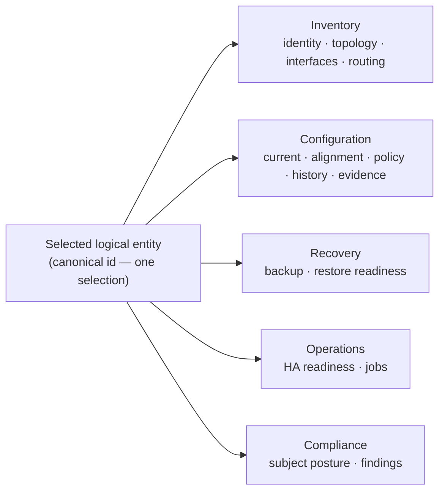

# Navigation & product information architecture

## Status

**DRAFT — PRODUCT OWNER REVIEW REQUIRED.** Nothing in this document is frozen,
and nothing in it authorizes an implementation (`AGENTS.md` "Contract-status
law", "Authority hierarchy" item 2).

An earlier revision of this file declared itself `FROZEN` on the strength of a
working prototype and its tests. **That was a self-declared freeze without
Product Owner authority and it is withdrawn.** Tests prove the prototype
matches the contract it was written against; they do not prove the contract is
the right product architecture.

**Review round 1 result (2026-09-05).** The Product Owner reviewed revision 1
and **substantially accepted its direction**, closing eight navigation
decisions (`PO-NAV-1`…`PO-NAV-8`, §16) plus the runtime, storage, trust and
enrollment directions in the companion DRAFT. It is **still not frozen**, for
two reasons: one **evidence-integrity correction** was required — revision 1
misattributed a set of supplied screenshots to third-party products, and every
conclusion resting on them is withdrawn (research appendix §0.2) — and several
decisions were returned with their **ownership corrected** rather than simply
approved (`PO-NAV-6`, `PO-NAV-7`, `PO-NAV-8`, D-NAV13, the freeze-vs-merge
gate). The remaining `D-NAV` rows still marked PROVISIONAL are exactly the ones
the review did not individually rule on.

The prototype remains **design evidence**. The Product Owner has *not* approved
the merge, or the replacement of the active roadmap movement.

| | |
| --- | --- |
| **Movement** | `ARCHITECTURE` (navigation + product IA), continuing the `NAV.1` prototype |
| **Revision** | **2 — 2026-09-05.** Records the Product Owner's review decisions (§16) and withdraws every conclusion that rested on misclassified benchmark screenshots (research appendix §0.2). Still DRAFT: the review closed direction, not the contract |
| **Prototype** | commit `5a5a1f7` on `claude/left-nav-vertical-redesign-e673q6` — runnable, behaviourally unchanged by this review |
| **Authorizes** | nothing. No UI behaviour, no storage, no enrollment, no job, no collector, no production wiring |
| **Companion DRAFT** | `docs/design/LOCAL_CONTROL_PLANE_RUNTIME_AND_ENROLLMENT.md` — runtime, storage, jobs, enrollment, sequencing |
| **Research appendix** | `docs/design/research/NSPM_NAVIGATION_BENCHMARK.md` — sources, access dates, evidence grades |
| **Preserves unchanged** | `docs/design/OPERATOR_CONSOLE_ARCHITECTURE.md` (`CON.0`) §3/§4/§6/§7/§9/§10; `docs/design/PRODUCT_CONTROL_PLANE_ARCHITECTURE.md` (`PCP.0`) §8/§9/§12/§13/§19; `docs/design/FAILOVER_ENGINE_ARCHITECTURE.md` §10/§10.1/§10.2; `RB.x`; `utils/action_taxonomy.py`; every payload builder's output; every pre-existing route |
| **Reopens** | nothing frozen. Where a `PCP.0` amendment would eventually be needed, it is *proposed with its trigger* in the companion DRAFT §11 and **not applied** |

### Decision grades used throughout

| Grade | Meaning |
| --- | --- |
| **ACCEPTED DIRECTION** | the Product Owner has accepted this direction; detail may still change |
| **PROVISIONAL** | this document's recommendation, implemented in the prototype, awaiting review |
| **OPEN PO DECISION** | a real fork the Product Owner must still resolve; the remaining ones are in §16.1 |
| **DECIDED** | closed in direction by the Product Owner's review; recorded in §16 |
| **RESERVED** | named in the target architecture, deliberately **not rendered** today |
| **REJECTED** | evaluated and declined, with the reason recorded |

---

## 0. How to read this document

Three layers, deliberately separate, because collapsing them is what produced
the flat menu this work started from:

```
Layer 1  Product navigation   — what the platform can do across the fleet
Layer 2  Context navigation   — the selected logical entity's workspace
Layer 3  Contextual actions   — what may be done, here, now, to this subject
```

A capability's *existence* (Layer 1), its *applicability to the selected
subject* (Layer 2), its *evidence state* (Layer 2/3) and its *authorization*
(Layer 3, future) are **four different questions** (§7). The prototype answered
only one of them, which is the central finding of this review.

---

## 1. Problem

The shipped shells carried one horizontal `<nav class="module-nav">` with **one
root button per module**: Overview, Network Inventory, Configuration,
Compliance, Discovery, Failover, Exclusions, Project Plan.

1. **A flat action list, not an information architecture.** Eight sibling roots
   say nothing about which are product domains (Configuration) and which are one
   view inside a domain (Exclusions). Below 900 px the CSS already abbreviated
   four labels and let the rest fall off the readable end.
2. **It cannot absorb the Product Control Plane.** `PCP.4` adds a per-device
   experience; `PCP.5` a typed job plane; `RB.x` a recovery surface. Under
   one-root-per-view each becomes another top-level button and device-scoped
   functions duplicate as unrelated roots.
3. **Nothing tied a navigation entry to a real backend.** An entry existed
   because someone wrote a `<button>`.

The prototype addressed (1) and (2) well, and addressed (3) with a rule that is
**necessary but not sufficient** — see §2 and §7.

---

## 2. Challenge review of the `NAV.1` prototype

Deliberately adversarial. The prototype is evidence, not a defendant with
tenure.

### 2.1 Successful and worth preserving

| Finding | Why it holds |
| --- | --- |
| **Left vertical rail** as primary product navigation | Corroborated externally: Tufin's navigation bar is "on the panel to the left of the screen"; SmartConsole's "Gateways & Servers" is "from the left navigation panel". It also removes the horizontal width ceiling that forced label abbreviation |
| **Domain grouping instead of one root per view** | Six roots over nine panels; the rail has room to grow into `PCP.4`/`PCP.5` without a new root each time |
| **Collapse is presentation density only** | Browser-verified: identical `data-module` set collapsed and expanded. This is the right invariant and must survive every later revision |
| **Routes derived from one model** | Removed a real drift bug (`#discovery`/`#failover`/`#exclusions` fell back to Overview from the URL hash). The principle — one declaration, routes derived — is durable |
| **One model shared by the rail and the device tab strip** | Prevents two divergent navigation implementations, which is exactly how the horizontal strip and the config tabs had already diverged |
| **"Add Device" declared but not rendered** | The *location* of a future action is decided and reviewable without a placeholder being drawn. Keep the pattern; §9 corrects how availability is decided |
| **Delegated click dispatch on the rail** | Makes the rail safely re-renderable, which the capability-driven model in §7 will need |
| **Zero console errors, both harnesses green, action-free report intact** | The prototype does not regress any existing invariant |

### 2.2 Good *current-shell implementation detail*, not architecture

These are correct today and must not be mistaken for product law:

- **`[data-module-panel]` existence as the availability test.** A pragmatic
  last-mile integrity check for a two-shell, no-build-step frontend. It is not a
  capability model (§2.4, §7).
- **The `jobs` panel living only in `console.html`.** Correct today because the
  `CON.2` job engine is console-only. It is a *shell-shipping* fact, not a
  statement that job evidence may never be exported (§12).
- **Six roots.** The right *shape*; the membership is provisional (§4).
- **Per-group collapse persisted in `localStorage`.** Fine; per-viewer
  convenience, no product meaning.
- **Icon choice, rail width, chevron behaviour.** Visual detail.

### 2.3 Durable product-IA decisions the prototype got right

- Product navigation is **left, vertical, grouped by domain**.
- **Device-scoped functions are tabs inside an entity experience, never roots.**
- **"Add Device" is never a navigation root.**
- **Collapse never changes availability or authority.**
- **Navigation location alone grants no action authority.**

### 2.4 Prematurely frozen or pre-decided — corrected here

| Prototype claim | Correction |
| --- | --- |
| The document declared itself **FROZEN** | Withdrawn. DRAFT, PO review required |
| **D-NAV6** presented DOM presence as *the* anti-placeholder law | Downgraded to a **last-mile surface-integrity check**, one conjunct of four (§7). A `<section>` in a template is not evidence that a backend contract exists |
| **D-NAV5** stated as fact that browser enrollment "waits for `DEPLOY.1A`" | The prototype's own comment pre-decided a Product Owner question, and was corrected in source. The Product Owner has since decided (`PO-NAV-1`, companion §9.1): a **conditioned local-loopback** direction, not an unconditional wait — so revision 1's assertion was wrong in substance as well as in authority |
| **Six roots** presented as "the information architecture" | PROVISIONAL. Recovery and Jobs/Automation were not evaluated at all in the first pass (§4) |
| **Jobs rejected as a root** on the strength of one shell | The reasoning (a root absent from one shell is a bad fact) is sound. Revision 1 cited "BackBox ships Jobs as a top-level menu" as external counter-evidence; **that observation is withdrawn** (appendix §0.2) and no retrievable source establishes any competitor's Jobs placement. Settled instead by decision: `PO-NAV-8` keeps Jobs under Operations, with **no** automatic promotion promise |
| **`NAV.1` recorded as `automated_validated`** in project state | Corrected on this branch: a PO-review movement, non-terminal, prototype status (§ project-state correction in the companion DRAFT §12) |

### 2.5 What breaks once SQLite, enrollment, schedules, recovery, device jobs and RBAC arrive

This is the most important section of the review.

1. **Availability stops being a DOM question.** Once capability projections
   exist (`PCP.3`), a shipped panel may be *inapplicable* to the selected
   entity, or applicable but *unsupported* for its vendor. The prototype has no
   vocabulary for that and would either show a working-looking empty tab or
   (worse, if the rule were extended naively) delete the tab.
2. **Entity selection becomes global state the rail does not model.** Today
   Inventory and Configuration each hold their own independent selection.
   With a device workspace, "selected entity" is cross-module state that must
   survive navigation (§6.6).
3. **A registry-keyed world introduces `NOT_ENROLLED`.** An entity present in
   `unified.json` but absent from the Device Registry — and the reverse — is a
   real state the current model cannot express (§7.3).
4. **Schedules are per-device, per-capability.** FireMon puts "Enable
   Scheduled Retrieval" on the device with its own interval. That does not fit
   anywhere in the current rail and must not be smuggled into navigation state
   (§4.3, companion DRAFT §9).
5. **Recovery becomes a domain, not a tab.** Restore-readiness across the fleet
   (`RB.5`/`CON.4`) is a fleet workflow; leaving it as one device tab under
   Configuration will be wrong then, and is defensible only until then.
6. **RBAC adds a fourth conjunct** that must be *additive*, never retrofitted by
   reusing the DOM check as a proxy for permission (§7.4, §15).
7. **Job history wants to be an entity tab**, and the prototype's Jobs entry is
   a fleet-level console panel. Both will exist; they are different data
   authorities over the same records (§6.7).

### 2.6 Legitimate report/console differences

Legitimate and must be preserved (`CON.0` §1/§3/§6):

- The report is a **portable, action-free evidence artifact**; the console is a
  **local, authenticated, action-capable** surface.
- Therefore: no job submission, no credential/trust selection, no enrollment,
  no mutation form in the report — **absent, not disabled**.

Illegitimate differences to avoid:

- A different *information architecture* between the two. One product IA,
  shared components; the two differ in **action availability and live data**,
  not in how the product is organised.
- Assuming "the report has no Jobs panel" means "job *evidence* may never be
  exported". Read-only, sanitized execution history in an exported report is a
  separate question, now **decided in principle with a ship trigger**
(§12, `PO-NAV-4`).

### 2.7 Navigation instability / capability disappearance risk

**This is the prototype's most dangerous property**, and the reason the DOM rule
is downgraded. As written, `navigationAvailableRoots()` drops any entry whose
panel is missing, and drops a group that loses all children. Extended to a
capability-driven world without §7's separation, that would mean:

- selecting a device without backup evidence could remove a **Recovery** entry
  the operator used a minute ago;
- an empty group could vanish and **reflow the whole rail**, moving every
  entry under the operator's cursor;
- a transient payload failure could look like a **capability that was revoked**.

**Rule adopted here (D-NAV11):** the rendered *root set* is a function of
**product-surface eligibility only** (§7.1) — never of the selected entity,
never of evidence state, never of a payload's contents. The rail is stable
while an operator works. Emptiness is expressed **inside** the module, in
words, never by the module disappearing.

### 2.8 "Unavailable" vs "unsupported for *this* device"

The prototype can only omit. It cannot say:

> Backup is a product capability. **This** device is a Gaia embedded appliance
> outside the `D3` pilot allowlist, so the backup job is `BLOCKED`, and the
> reason is that allowlist — not a missing feature.

Conflating those two is a product-integrity failure, not a cosmetic one: it
tells the operator the product cannot do something it can. §7's four predicates
and §8's presentation matrix exist to make each case say what it actually is.

---

## 3. Decision register

Re-graded. `FROZEN` appears nowhere.

| id | Decision | Grade |
| --- | --- | --- |
| **D-NAV1** | Primary product navigation is a **left vertical rail**; the topbar keeps brand + module-context controls only | **ACCEPTED DIRECTION** (visual direction accepted by the PO) |
| **D-NAV2** | The rail is collapsible; **collapse changes presentation density only** — never the entry set, never availability, never authority | **ACCEPTED DIRECTION** |
| **D-NAV3** | Group by **stable product domain**, not by action. A domain with one shipped view renders as a direct root link and becomes a group by gaining children, with no route change | **ACCEPTED DIRECTION** (`PO-NAV-8`). Note: revision 1 claimed external corroboration for domain group headings; that is withdrawn (appendix §0.2) — this rests on neXus' own domains and the PO's decision |
| **D-NAV4** | **Devices is a first-class root**; the device experience is never a sub-view of Configuration | **ACCEPTED DIRECTION** |
| **D-NAV5** | **"Add Device" is never a navigation root.** Primary affordance in the Devices/entity-list pane header; **Administration → Device Management** is the lifecycle home; **one enrollment contract**, no duplicate implementation; Configuration never owns device lifecycle | **ACCEPTED DIRECTION** (`PO-NAV-1`). Rendering it locally is approved *in direction* under the conditions in the companion DRAFT §9; production exposure stays blocked on `DEPLOY.1A` |
| **D-NAV6** | ~~DOM presence is the availability law~~ → **superseded by D-NAV6a/D-NAV6b** | **CORRECTED** |
| **D-NAV6a** | A rendered navigation entry requires **product-surface eligibility**: a declared shipped contract, a shell permitted to expose it, and the surface actually present. DOM presence is the *last* of the three, an integrity check, not the rule | **PROVISIONAL** |
| **D-NAV6b** | **No visual placeholder.** A capability with no product surface is omitted. A capability *with* a surface that is currently inapplicable, unsupported, unconfigured, blocked or evidence-poor is **shown, selectable where useful, and explained in words** — never a bare greyed control (`CON.0` §9 honest affordances) | **PROVISIONAL** |
| **D-NAV7** | **Progressive population**: shipping a capability into navigation is adding its surface plus one model row. No route table, no `switchModule` list, no CSS | **PROVISIONAL** |
| **D-NAV8** | Routes are **preserved and derived** from the model; every pre-existing hash/localStorage route keeps working | **ACCEPTED DIRECTION** |
| **D-NAV9** | **Authorization-aware, not authorization-implementing.** `navigationAuthorizationContext()` returns `model: "none"`. No role/permission/scope/claim gates any navigation decision until a real OIDC/RBAC model exists | **ACCEPTED DIRECTION** |
| **D-NAV10** | **Three layers** (product navigation / entity context / contextual actions) are separate concerns with separate rules | **PROVISIONAL** |
| **D-NAV11** | **Root stability**: the rendered root set depends on product-surface eligibility only — never on the selected entity, evidence state or payload contents | **PROVISIONAL** |
| **D-NAV12** | **One selected-entity context** is shared across modules; each module keeps its own **independent data authority** over that subject | **PROVISIONAL** |
| **D-NAV13** | **Device-tab stability (corrected).** Where a workspace surface exists, its canonical tab position is stable across entity types and must not flicker with selection or evidence. A structurally inapplicable tab stays **visible and selectable** with a `NOT_APPLICABLE` explanation and no enabled action. A tab is omitted **only** on a P1 failure — the surface does not exist in that build/shell | **ACCEPTED DIRECTION** (§6.5) |
| **D-NAV14** | **Colour semantics (corrected by `PO-NAV-6`).** The pale yellow/gold comparison emphasis that makes member differences noticeable is **preserved**; what changes is that colour alone never carries meaning. Every state has an explicit textual label, expected member differences carry **no** warning icon or wording, and red stays reserved for actual fault, unsafe drift or failure | **ACCEPTED DIRECTION** (§5.4) |

---

## 4. Layer 1 — product navigation

### 4.1 Candidate domain evaluation

Every candidate was evaluated against **what the repository can serve today**
and **where the product is going** (`PCP.0` §1). "Serve" means a shipped payload
or contract, not a plan.

| Candidate | Verdict | Reasoning |
| --- | --- | --- |
| **Overview** | **root link** — ACCEPTED DIRECTION | The landing surface, not a domain with views. Every benchmarked product lands on a dashboard |
| **Devices** | **grouped root** — ACCEPTED DIRECTION | First-class (D-NAV4). Today: `Inventory`, `Discovery`. Target: the **entity workspace** becomes its primary child, with the fleet list as its index |
| **Configuration** | **root link today; root + entity tab in target** — ACCEPTED DIRECTION (`PO-NAV-3`) | `AGENTS.md` forbids collapsing Configuration into Inventory: they are separate product planes. Fleet-wide alignment review is a real cross-device workflow — externally, Tufin's Compare Revisions is a first-class view with its own device-tree pane (appendix §2, DOC-EXCERPT). **Decided** by `PO-NAV-3`: the global root keeps fleet-level work; device-level views use the shared entity workspace |
| **Operations** | **grouped root** — ACCEPTED DIRECTION (`PO-NAV-8`) | "What is running, and what may be run, against the fleet." Today: `HA & readiness`, `Jobs`. The mature default set is `Jobs`, `Schedules`, `Queue`, `History` and future typed automation definitions — a **Product Owner decision**, not an observed competitor pattern (revision 1's BackBox citation is withdrawn, appendix §0.2) |
| **Jobs** | **child of Operations — the default, with no promotion promise** — ACCEPTED DIRECTION (`PO-NAV-8`) | Today its only surface is the console job list, which the action-free report must not carry. As Operations gains `Schedules`, `Queue` and `History`, the mature end-state is **several execution surfaces under Operations**, not one promoted page. A root promotion is **not pre-approved**: it would need a new PO-reviewed IA amendment justified by real information density and operator workflow |
| **Automation** | **RESERVED — not a separate domain** | neXus' "automation" is the **typed job definition + schedule** half of the job plane, and belongs under Operations beside `Jobs` (`PO-NAV-8`), not as a rival domain. Named in the target architecture and **not rendered** until `PCP.5` gives it definitions to show |
| **Compliance** | **root link** — ACCEPTED DIRECTION | A shipped product plane with fleet and subject views already built |
| **Recovery** | **RESERVED — future root, not rendered today** | Today the only recovery surface is one device tab (`configBackupPanel`) plus an Overview card. `RB.4`/`RB.5`/`CON.4` bring restore-readiness and recovery-store surfaces that are **fleet** workflows; at that point a device tab is the wrong home. **Decided** by `PO-NAV-2`: promote only when a real fleet-level restore-readiness and/or recovery-store surface ships under its `RB`/`CON` contract. Once it is a root it stays a root even when the selected device is `UNPROTECTED` or `NOT_CONFIGURED` (D-NAV11) |
| **Administration** | **grouped root** — PROVISIONAL | Today: `Inventory exclusions`, `Project plan`. Target children in §4.4 |
| **Diagnostics** | **RESERVED** | `PCP.8`, closed runbook catalog. No surface, no entry |
| **Topology / Risk / Policy authoring** | **REJECTED** | Policy authoring is `CLASS 3` (prohibited). Topology/risk analysis is not in `PROJECT_VISION.md`'s scope and inventing a root for it would advertise a capability the product does not have |

### 4.2 Current shipped IA (what the prototype renders today)

| Root | Kind | Children rendered | Backing surface |
| --- | --- | --- | --- |
| Overview | link → `overview` | — | `overview_ui.js` over existing payloads |
| Devices | group | `Inventory` → `inventory`; `Discovery` → `discovery` | `inventory_ui.js`; `discovery_ui.js` |
| Configuration | link → `configuration` | (7 device tabs) | `configuration_ui.js` |
| Operations | group | `HA & readiness` → `failover`; `Jobs` → `jobs` *(console shell only)* | `failover_readiness_ui.js`; `console_actions.js` + `CON.2` API |
| Compliance | link → `compliance` | — | `compliance_ui.js` |
| Administration | group | `Inventory exclusions` → `exclusions`; `Project plan` → `project-plan` | `inventory_exclusions` payload; `project_plan.py` |

Six roots, nine module panels, zero placeholders. This is a **candidate
baseline**, not the approved target.

### 4.3 Target IA (proposal, requires PO approval)

Rendered only as each row's surface actually ships.

| Root | Target children | Promotion trigger | Grade |
| --- | --- | --- | --- |
| **Overview** | — | — | ACCEPTED DIRECTION |
| **Devices** | `Fleet` (entity list + workspace), `Discovery` | entity workspace ships (`PCP.4`) | PROVISIONAL |
| **Configuration** | fleet alignment/posture views; device-scoped views move into the workspace | `PCP.4` | PROVISIONAL, split OPEN (`PO-NAV-3`) |
| **Operations** | `HA & readiness`, `Jobs`, later `Schedules`, `Queue`, `History`, future typed automation definitions | each on its own surface shipping | **ACCEPTED DIRECTION** (`PO-NAV-8`) |
| **Compliance** | — (fleet + subject views already inside) | — | ACCEPTED DIRECTION |
| **Recovery** | `Restore readiness`, `Recovery store` | a real **fleet-level** restore-readiness and/or recovery-store surface ships under its `RB`/`CON` contract | **RESERVED — promotion rule accepted** (`PO-NAV-2`) |
| **Administration** | `Device management` (registry lifecycle + enrollment), `Credential profiles` *(references only)*, `Trust profiles`, `Inventory exclusions`, `System & runtime health`, `Users & roles` | each on its own backend; `Users & roles` on `DEPLOY.1A` only | PROVISIONAL |
| *(Automation, Diagnostics)* | — | `PCP.5` / `PCP.8` | RESERVED, not rendered |

**Jobs stays a child of Operations — corrected.** Revision 1 promised that Jobs
would become a root once it owned definitions, executions, schedules and
history. **That automatic promise is withdrawn** (`PO-NAV-8`). The mature
default is Operations growing several execution children — `Jobs`, `Schedules`,
`Queue`, `History`, future typed automation definitions — not one of them being
promoted. A root promotion is **not pre-approved**; it would require a new
PO-reviewed IA amendment justified by real information density and operator
workflow.

**Recovery's promotion rule, stated exactly** (`PO-NAV-2`): it is a reserved
future global root, **not rendered today**; device/entity Recovery remains a
contextual workspace tab; it promotes only when a real fleet-level
restore-readiness and/or recovery-store surface ships under the relevant
`RB`/`CON` contract; and once the global root exists it **stays visible
regardless** of whether the selected entity is protected, unsupported or not
configured (D-NAV11).

**Reserved domains are written here and rendered nowhere.** A `RESERVED` row is
a commitment about *where* a capability will live, so later work does not
re-litigate the IA — it is never a "coming soon" entry (D-NAV6b).

### 4.4 Administration children — direction vs today

| Child | Today | Direction |
| --- | --- | --- |
| Inventory exclusions | shipped, read-only | stays; write path stays blocked (`inventory_exclusions_management_ui_backend`, `DEPLOY.1A`) |
| Project plan | shipped | see §14 — development visibility now, administration/developer-only later |
| Device management | **none** | registry lifecycle + the enrollment action's second home (`PCP.2`/`PCP.4`) |
| Credential profiles | **none** | **opaque references only**, never secret material (companion DRAFT §10) |
| Trust profiles | **none** | host-key/CA trust references (`pcp_first_contact_trust_policy`) |
| System & runtime health | **none** | control-plane service state, job runner health (companion DRAFT §6) |
| Users & roles | **none** | `DEPLOY.1A` only. **Must not be rendered before a real authorization model exists** — a fake user page is worse than none |

---

## 5. Layer 2 — context navigation (the entity workspace)

### 5.1 What it answers

For **one selected logical subject**: what is this object, what evidence exists
for it, what may be viewed or operated on it, and what state applies.

### 5.2 Logical subject types and default selection level

**The Product Owner's model is logical-entity-first**: a cluster or HA pair is
normally **one managed operational object**, with physical members represented
beneath it. Externally corroborated by the two sources that survive evidence
review — SmartConsole nests cluster members inside the opened cluster object,
and Tufin's device hierarchy shows management devices with the devices they
manage (appendix §7.1, §2). It is also already true of neXus itself: virtual
systems render beneath their VSX parent and HA children beneath their unit
(appendix §1, REPO-VERIFIED).

**No second identity authority is created.** The workspace *selects* an existing
canonical id and *renders* backend-derived relationships. It never computes
identity, pairing, topology or readiness (`PCP.0` §13, `OP.2.0` P4/P14).

| Logical subject | Default selection | Members / children shown | Existing identity + topology authority |
| --- | --- | --- | --- |
| Standalone CP gateway | the device | — | `unified.json` entity id; registry `device_id` once enrolled |
| **CP ClusterXL cluster** | **the cluster** | physical members nested | `cp_runner.enrich_cluster_topology` (`group_id` VIP fingerprint); `OP.2.0` P8 |
| CP ClusterXL member | drilldown from its cluster; **never the default view of the cluster** | — | member token; presentation identity is never a join key |
| **CP VSX host / cluster** | **the VSX cluster** | physical members **and** nested virtual systems | `vsx_parser`; `OP_0B_S4A` |
| CP virtual system (VSID) | nested child of the VSX parent; selectable in its own right | — | VSID is a **readiness** domain under VSLS, and **never** a `CLASS 2` lock subject (`FAILOVER_ENGINE_ARCHITECTURE.md` §10.2) |
| Standalone PAN firewall | the device | vsys as subordinate context | serial (opaque) |
| **PAN HA pair** | **the pair** | 2 members nested | `PCP.0` §12; management-plane correspondence only (S8-C `MATCH`) |
| PAN HA member | drilldown only | — | serial; **`B₂` bidirectional corroboration NOT ESTABLISHED** — the workspace must not imply it is |

**Fail-closed rule:** where the pair/cluster relationship is not established
(the open PAN `B₂` question), the workspace shows the members it can prove and
says the relationship is `UNKNOWN` — it does **not** draw a confident pair.

### 5.3 Shared vs member-specific values

Render a value **once** when it is semantically shared across the logical
entity; show it **side by side** when it legitimately differs per member.

| Shared (render once) | Member-specific (render side by side) |
| --- | --- |
| cluster virtual IP (VIP) | HA role (`ACTIVE` / `STANDBY`) |
| shared/logical interface | member serial numbers |
| common route | member management IP |
| shared policy / configuration fact | sync addresses |
| cluster-level identity (model, version family) | member-local routes and configuration settings |

### 5.4 Difference semantics — one meaning per treatment (`PO-NAV-6`)

Revision 1 recommended that Inventory simply adopt Configuration's blue `info`
tone for `MEMBER_SPECIFIC`. **The Product Owner has rejected that specific
remedy and kept the underlying problem.** The pale yellow/gold emphasis that
makes cluster-member differences easy to *notice* is a real product benefit and
is preserved; what must change is that the colour stops being the only carrier
and stops implying fault.

The defect being fixed is genuine: Inventory paints every member-scoped row with
the warning token (`.difference-row`, `.scope-chip.diff`, `.divergence-badge`
all use `--warning`), while Configuration already separates the cases
(`statusTone()`: `MEMBER_SPECIFIC` → `info`, `LOCAL_OVERRIDE` → `warning`,
`EFFECTIVE_DRIFT` → `danger`). Two planes therefore say different things about
the same fact.

**Adopted contract:**

| Semantic | Canonical state | Treatment | Required label | Icon / wording rule |
| --- | --- | --- | --- | --- |
| **Expected member difference** | `MEMBER_SPECIFIC` | **may keep the pale yellow / gold row emphasis** in member-comparison views | "Expected member difference" or "Member-specific" | **No** warning or failure icon; no failure wording |
| Intentional local override | `LOCAL_OVERRIDE` | stronger attention treatment | "Local override" | attention iconography permitted |
| Unclassified difference | `DIFFERENCE_OBSERVED` | attention / warning semantics | "Difference observed" | attention iconography permitted |
| Effective unexplained drift | `EFFECTIVE_DRIFT` | **danger / error** | "Effective drift" | error iconography |
| Manager/device out of sync | `PANORAMA_OUT_OF_SYNC` | **danger / error** | "Out of sync" | error iconography |
| Contradictory / unsafe state | `IDENTITY_TRANSLATION_REQUIRED`, `RELATIONSHIP_INCONSISTENT` | **danger / error**, with an explicit explanation | "Contradictory evidence" | error iconography |
| Stale or incomparable evidence | `PROVENANCE_UNVERIFIED`, `last_known_good` | muted / provenance | "Stale evidence" + timestamp | none |
| Unknown / insufficient | `UNKNOWN`, `INSUFFICIENT_EVIDENCE` | muted | "Insufficient evidence" | none |

**Rules that bind every row:** red is reserved for **actual fault, unsafe drift
or failed state** — never for a difference that is expected. Colour is never the
only carrier: each state carries its text label, and non-colour differentiation
(chip text, member name, iconography where permitted) must make the state
readable in high contrast and to a colour-blind operator. Unification is of
**semantic meaning across modules**, not of palette: Inventory does not simply
copy Configuration's blue.

**Implementation is not in this movement.** No CSS or runtime change is made
here; the later vocabulary/presentation movement (`M3`) owns it.

---

## 6. The shared Device Workspace

### 6.1 The problem it solves

Inventory and Configuration currently maintain **two independent fleet lists and
two independent selections** over the same real devices. That is two navigation
models over one estate, and it is exactly the duplication D-NAV12 forbids.

### 6.2 One context, several data authorities



Each module keeps its **own payload builder, its own vocabulary and its own
authority**. They share *which subject is selected* and nothing else. Inventory
does not become the source of configuration truth, and Configuration does not
become an inventory (`AGENTS.md` engineering laws).

### 6.3 Selection mechanism — recommendation

| Option | Assessment |
| --- | --- |
| Persistent in-memory context only | loses selection on reload; no shareable state |
| **Hash route carrying module + entity** (e.g. `#configuration/<entity>`), plus `localStorage` for last selection | **RECOMMENDED.** Extends the existing derived-route model (D-NAV8), keeps the report working from `file://`, needs no server, and is deep-linkable within one document |
| Query parameters | the exported report is opened from disk; query strings are awkward and are stripped by some viewers |
| Server-side session | console-only; breaks report parity; adds state the report cannot have |

**Recommendation:** extend the hash route to `#<module>[/<entity-id>]`, with an
unknown or unresolvable entity segment falling back to "no selection" rather
than an error. Backwards compatible: a bare `#configuration` keeps working.
**Not implemented in this movement.**

### 6.4 Tab allocation — global vs entity

| Tab / view | Global root | Entity tab | Entity types | Notes |
| --- | --- | --- | --- | --- |
| Overview | yes (fleet) | yes (subject summary) | all | Different data authority, same name |
| Network / Inventory | yes (`Devices → Inventory`) | yes | all | Interfaces + routing live here |
| Configuration | yes (fleet posture) | yes | all | Split is `PO-NAV-3` |
| Alignment | no | yes | all with expected-intent evidence | Stays inside Configuration |
| Policy & Objects | no | yes | all | Device-scoped only |
| History | no | yes | all | Config history |
| Evidence | no | yes | all | Provenance/coverage |
| Compliance | yes (fleet posture) | yes (subject) | all | Already fleet + subject shaped |
| Recovery / Backups | RESERVED root | yes | all | Root on `PO-NAV-2` |
| HA / Readiness | yes (`Operations`) | yes — **visible for every entity type** | applies to cluster, VSX cluster, PAN HA pair, VSLS VSID | On a standalone device the tab stays visible and selectable and renders `NOT_APPLICABLE` naming the entity types that support it (§6.5) |
| Jobs | yes (console) | later (`PCP.5`) | all | Entity tab = this subject's runs |
| Diagnostics | no | RESERVED | — | `PCP.8` |
| Sanitized configuration | no | candidate | all | §10, contract required first |

### 6.5 D-NAV13 — device-tab stability (corrected)

Revision 1 left this ambiguous by allowing an inapplicable tab to be "either
omitted or shown". **That ambiguity is closed.**

Where a product/entity workspace surface exists, its **canonical tab position is
stable across managed entity types**. Selected-entity applicability and evidence
state **must not** make a tab flicker in and out.

| Case | Behaviour |
| --- | --- |
| **Structurally non-applicable** (e.g. HA on a standalone firewall) | keep the tab **visible and selectable**; render an explanatory `NOT_APPLICABLE` state; render **no enabled action**; **name which logical entity types support it** |
| **Unsupported / not configured / stale / failed / insufficient evidence** | keep the tab **visible and selectable**; show the **exact state and its reason**; expose only actions backed and permitted by a real contract |
| **No product surface in this build/shell** (P1 failure) | **omit the tab** — this is the only omission case |

This is what makes the Product Owner's requirement operable: **not every
capability need be active on every device**, and an operator's map of the
product must not rearrange itself when they select a different one.

---

## 7. Product-surface eligibility vs entity applicability vs evidence vs authorization

**This section is the correction the review exists for.** The prototype had one
predicate. There are four, and they are answered by different owners.

### 7.1 P1 — Product-surface eligibility *(decides Layer 1 visibility)*

A navigation entry is **eligible** when all three hold:

1. a **declared, shipped read or action contract** exists (a payload builder, an
   API route, a job type in the closed registry — not a plan, not a `<section>`);
2. **this shell is permitted to expose it** (`CON.0` §3/§6 — the report is
   action-free by contract);
3. the **UI surface is actually present** in this shell — the DOM check, kept as
   a last-mile integrity guard so a half-shipped shell fails visibly rather than
   rendering a dead entry.

**Only P1 decides whether a root or a global module is rendered** (D-NAV11).
P1 is a property of the *build*, not of the operator's current selection.

### 7.2 P2 — Selected-entity applicability *(decides content, never root visibility)*

Does this function apply to the selected logical entity **type**? A standalone
firewall has no HA readiness. A PAN device has no VSID. This is a **type**
question, answered from the entity model in §5.2 — not from evidence.

### 7.3 P3 — Capability / evidence state *(decides what the view says)*

Derived from `PCP.0` §8's capability projection plus existing evidence states:
is the capability supported for this vendor/platform, is it configured, is
evidence current, stale, missing, failed or insufficient?

Two concepts this layer needs that no existing state covers. **`PO-NAV-7`
approved the concepts and corrected their ownership**: revision 1 proposed them
as undifferentiated global canonical states, which would have put a
schedule-policy fact into the job lifecycle and a registry-reconciliation fact
into device capability. Both names stay **provisional** until the
capability-state vocabulary movement (`M3`) examines the existing schemas and
their owners.

| Concept (name provisional) | What it expresses | Owning domain — corrected | Explicitly **not** |
| --- | --- | --- | --- |
| *"capability policy disabled"* (working name `POLICY_DISABLED`) | this capability, on this device, is intentionally off — e.g. its schedule was disabled without disabling the device | the **schedule / capability-policy contract** | **not** a job lifecycle state; must **not** join `queued`/`running`/`succeeded`/`failed`/`blocked`/`skipped` |
| *"not enrolled"* (working name `NOT_ENROLLED`) | an entity present in evidence but absent from the Device Registry, or the reverse | the **registry / evidence reconciliation projection** | **not** a generic device capability state |

Neither is a global canonical state, and **no payload contract changes in this
movement.** `M3` owns the final names, owners and schemas.

### 7.4 P4 — Authorization *(future; absent, not permissive)*

`navigationAuthorizationContext()` returns `model: "none"`. There is no role,
permission, scope, claim or tenant check anywhere in the navigation path, and
there is **no "hidden because you lack access" state**, because there is nothing
to grant access. When `DEPLOY.1A` ships OIDC/RBAC, P4 becomes an **additional
conjunct** on actions and, where the PO decides, on entries — a `NAV.2`
amendment, never a silent edit, and never by reusing P1 as a permission proxy.

### 7.5 The rule that ties them together

> **A global product module never disappears because the selected device does
> not support or use that capability.**

P1 governs existence. P2/P3 govern what the module *says*. P4 governs what may
be *done*. Concretely:

- Recovery stays a product module while the selected device reports
  `NOT_CONFIGURED` or `UNSUPPORTED`.
- Configuration stays globally reachable while one device's evidence is stale or
  missing.
- Compliance stays a product plane while one subject is `NOT_APPLICABLE` or
  `INSUFFICIENT_EVIDENCE`.
- Operations/Jobs stays reachable while a specific action is `BLOCKED`.

---

## 8. Capability-state presentation matrix

Built entirely from **existing canonical states** in this repository, plus
`CON.0` §9's honest-affordance law; only the two §7.3 rows are proposals.
Revision 1 claimed external corroboration from competitor state vocabularies;
**that claim is withdrawn** (appendix §0.2) and was never needed — no
competitor's capability-state vocabulary is established by any retrievable
source, and this matrix does not rest on one.

| UX semantic | Existing canonical states to reuse | Nav entry | View / tab | Action | Presentation |
| --- | --- | --- | --- | --- | --- |
| **Current / available** | `live`; config artifact `available`; `PASS`; `READY`; job `succeeded`; action `AVAILABLE` | shown | selectable, populated | enabled | normal |
| **Stale** | `last_known_good`; `STALE`; `PROVENANCE_UNVERIFIED` | shown | **selectable**, data shown **with age + provenance** | enabled, with age stated | muted badge + timestamp; never blank |
| **No evidence / not collected** | `no_data`; config `unavailable` | shown | **selectable**, explanatory empty state naming what would produce it | "collect now" enabled where a contract exists | empty state with a reason |
| **Unsupported** | `UNSUPPORTED(reason)` (`PCP.0` §8, not yet implemented); `UNKNOWN_SHELL` | shown | selectable, states the vendor/platform reason | **disabled, visible, reason shown** | explicit "not supported on this platform" |
| **Not applicable** | `NOT_APPLICABLE`; `NOT_A_FAILOVER_UNIT` | shown | tab may be **omitted for that entity type** or shown as N/A — never shown broken | n/a | "does not apply to a standalone device" |
| **Supported but not configured** | `not_configured`; `UNPROTECTED` | shown | selectable, states what configuring it requires | enabled only if a configure path exists, else absent | actionable empty state |
| **Intentionally disabled by policy** | `EXCLUDED` (polling policy); `DISABLED` (registry lifecycle); *proposed* `POLICY_DISABLED` | shown | selectable, names the policy | **disabled, with the policy named** | never silent |
| **Blocked** | job `blocked`; action `BLOCKED`; `RecoveryCollectionBlockedError`; taxonomy refusal | shown | selectable | **disabled, refusing gate named** (`CON.0` §9 — never a bare greyed button) | e.g. "not in the D3 pilot allowlist" |
| **Failed** | job `failed`; `COLLECTION_FAILURE` | shown | selectable, shows the failure and its time | retry offered **as a new typed job**, never by mutating history | error state + last good evidence retained |
| **Skipped (correct outcome)** | job `skipped`; `RecoveryCollectionSkipped` | shown | selectable | enabled | **not an error** — e.g. ledger window already satisfied |
| **Unknown / insufficient** | `UNKNOWN`; `INSUFFICIENT_EVIDENCE` | shown | selectable, says what is missing | disabled if the action needs the missing fact | explicit, never inferred as "fine" |
| **Not enrolled** *(proposed)* | *proposed* `NOT_ENROLLED` | shown | selectable, offers enrollment where permitted | enrollment action per `pcp_console_registry_write_gate` | explicit |

### 8.1 Which states change navigation itself

| Effect | States |
| --- | --- |
| **Omit the view entirely** | only when **no product surface exists** (P1 fails) — never because of P2/P3 |
| **Keep selectable + explanatory empty state** | stale, no evidence, not configured, insufficient, failed, skipped |
| **Disable the action, keep it visible with a reason** | unsupported, blocked, policy-disabled, insufficient-for-this-action |
| **Omit a tab for an entity type** | not applicable (e.g. HA tab on a standalone device) — omitted **consistently for that type**, so it is a stable property of the type, not a flicker |
| **Explicit warning required** | contradictory evidence, effective drift, out-of-sync |
| **Must fail closed** | anything feeding an action decision: unknown/insufficient never reads as permitted; a stale projection never authorizes a job (`OP.2.0` P4/P14) |

---

## 9. Layer 3 — contextual actions

An action's **existence, visibility and enabled state** derive from: a real
backend/action contract; selected-subject applicability; capability evidence;
current operational state; and — once it exists — authorization.
**Navigation location never grants action authority.**

| Action | Home | Today |
| --- | --- | --- |
| **Add device (enroll)** | Devices / entity-list pane header (primary) **and** Administration → Device Management (lifecycle) — one contract, `PO-NAV-1` | **not rendered.** The local-loopback direction is approved, but nothing is implemented: movement `M9` must implement all seventeen conditions in companion §9.1 first |
| Refresh / collect now | selected entity, in the capability's own view | console `CON.2` read-class job types exist; per-device targeting needs `PCP.6` seams |
| Configure / change schedule | the device capability | `PCP.5`; policy editing from a browser is gated by `C-D7` |
| Run backup | Recovery view of the entity | `CON.3` + `RB.3b`; `recovery-cp` unscheduled by `D3` |
| Assess restore readiness | Recovery view | `compute_restore_readiness` exists (class 0) |
| Start typed job | Jobs / the capability view | `CON.2` closed registry only |
| Begin controlled HA action | entity HA tab (`OP.2.D`) | **`CLASS 2` has no member and is unreachable**; nothing renders |

**The prototype's "declare, don't draw" pattern is kept and corrected**: an
action is declared against a domain with its availability and reason, and the
renderer emits only those whose backend contract exists. The correction is that
the reason must state the *actual* gate (an open PO decision) rather than
asserting a decision that has not been made.

---

## 10. Sanitized configuration view

The Product Owner wants an optional "show configuration" view for the selected
entity. Three candidates, with different security weight:

| Candidate | What it is | Assessment |
| --- | --- | --- |
| **(a) Sanitized projected configuration** | the normalized, already-parsed settings the `configuration_ui` payload carries today, rendered as a readable document | **Product candidate now.** No new evidence class, no new retention, no new redaction boundary — it re-presents what both shells already receive |
| **(b) Redacted source-view representation** | a text-shaped rendering closer to device output, produced by an explicit projection + the existing redaction registry | **Candidate, contract required first.** Touches `AGENTS.md` raw-evidence law (do not persist raw output for convenience), needs a defined projection, redaction proof, retention rule and support-bundle exclusion. Its own movement and security review |
| **(c) Privileged raw configuration retrieval** | unprojected device output | **NOT AUTHORIZED HERE.** A separate future security decision requiring explicit authorization, audit, data-egress and retention rules. This navigation review does not and cannot grant it |

**Non-negotiable for (a) and (b):** never expose credential payloads, private
keys, tokens, password hashes or reversible secrets, secret-bearing raw blocks,
unredacted support-sensitive values, or command output that has not passed an
approved projection/redaction boundary.

**Report vs console:** (a) may appear in both if it carries no new sensitive
field. (b) is **console-only** until its contract says otherwise — the exported
report travels.

---

## 11. Preservation matrix

Every valuable behaviour the current UI has, and what happens to it. "Preserved"
means **behaviourally unchanged by `NAV.1` as prototyped**.

| Behaviour | Current owner | Target global domain | Target entity context | Status | Acceptance criterion |
| --- | --- | --- | --- | --- | --- |
| Cluster interface matrix (`interface \| VIP \| member… \| network`) | `inventory_ui.js` | Devices | Inventory tab | **Preserved** | Matrix renders for a ClusterXL/VSX entity with VIP column when VIPs exist |
| Route comparison modes (`Logical \| member \| Diff only`) | `inventory_ui.js` | Devices | Inventory tab | **Preserved** | All three modes selectable on a divergent multi-member entity |
| Explicit member-scope column + `Shared`/member chips | `inventory_ui.js` (`memberScope`, `.scope-chip`) | Devices | Inventory tab | **Preserved** | Chips keep an explicit text label for every state (§5.4) |
| **Pale yellow/gold member-difference emphasis** | `inventory_ui.js`, `.difference-row` / `.scope-chip.diff` | Devices | Inventory tab | **Preserved — the Product Owner values it** | `MEMBER_SPECIFIC` may keep the pale emphasis, must carry "Expected member difference"/"Member-specific", and must carry **no** warning icon or failure wording; red stays reserved for fault (§5.4, `PO-NAV-6`) |
| Interface/route divergence badges | `inventory_ui.js` | Devices | entity header | **Preserved** | Badge present when divergence exists |
| Expandable VSX hierarchy under its parent | `inventory_ui.js` | Devices | entity tree | **Preserved; strengthened** | VS nested under the VSX parent (externally corroborated) |
| Compact ClusterXL/VSX/failover hierarchy | `inventory_ui.js`, `failover_readiness_ui.js` | Devices / Operations | entity tree | **Preserved** | Hierarchy renders without a second identity model |
| Collapsible device details | `configuration_ui.js` (`configHeaderToggle`) | Configuration | entity header | **Preserved** | Expand/collapse persists per viewer |
| Device facts (vendor, model, software, mgmt endpoint, serial, HA role, VSYS/VS, ClusterXL, config freshness, source) | `configuration_ui.js` | Devices/Configuration | entity header | **Preserved** | All facts still rendered, freshness included |
| Global search + vendor/device filtering | topbar + module sidebars | Devices | entity list | **Preserved; unify later** | Search still filters; a single entity search is a later movement |
| Left context pane + main workspace | Inventory, Configuration, Compliance | all device-centric domains | workspace shell | **Preserved** | Pane + workspace retained under the rail (three-column shape) |
| Current/stale/failure provenance | `snapshot.py` → every module | all | everywhere | **Preserved** | `data_state` still surfaced verbatim |
| Configuration alignment classifications | `configuration_ui.js`, `app_core.js` `statusTone()` | Configuration | Alignment tab | **Preserved; semantics become shared** | Both planes give one meaning per treatment — **semantic** unification, not palette copying (§5.4) |
| Compliance fleet + subject views, framework filter, explain panels | `compliance_ui.js` | Compliance | Compliance tab | **Preserved** | Unchanged |
| HA readiness verdicts and check tables | `failover_readiness_ui.js` | Operations | HA tab | **Preserved** | `SAFE_TO_FAILOVER` remains unreachable |
| Console job types with `BLOCKED` + reason | `console_actions.js` | Operations → Jobs | Jobs tab later | **Preserved** | Blocked types still render their refusing class |
| Dark theme + theme toggle | `app_bootstrap.js` | — | — | **Preserved** | Toggle works in both shells |
| Report/console visual parity | both shells | — | — | **Preserved** | One IA, differing action availability only (§12) |
| Exported report is action-free | `html_export.py` | — | — | **Preserved** | No form, no submit, no fetch in the composed script |
| Collapsible left rail | `navigation_ui.js` (`NAV.1`) | — | — | **New, prototyped** | Identical entry set collapsed and expanded |
| Device tab strip driven by the model | `navigation_ui.js` (`NAV.1`) | — | all | **New, prototyped** | Tabs render in canonical order |
| Per-device schedules | — | Operations / entity capability | capability view | **Deferred** (`PCP.5`) | Not rendered until definitions exist |
| Entity workspace with one shared selection | — | Devices | workspace | **Deferred** (`PCP.4`) | Not implemented in this movement |

---

## 12. Shell parity — exported report vs Operator Console

One product IA, shared components. The shells differ in **action availability
and data liveness**, not in how the product is organised (`CON.0` §6).

| Aspect | Exported static report | Operator Console | Rule |
| --- | --- | --- | --- |
| Navigation IA | identical root/domain model | identical | one model, one source (D-NAV7) |
| Rail, groups, collapse, routes | identical | identical | shared component |
| Evidence projections | inline payloads | `GET /api/payloads` | same builders, same shapes (`CON.0` §6 parity invariant) |
| Job submission | **absent** | typed intent, closed registry | never a disabled control in the report — absent |
| Credential / trust selection | **absent** | future, references only | never in the report |
| Enrollment | **absent** | gated (`pcp_console_registry_write_gate`) | never in the report |
| Live refresh | none (snapshot) | `/api/payloads`, ≥30 s opt-in | report must work from `file://` |
| Jobs module | no panel → no entry | panel → entry under Operations | P1 in action |
| **Read-only job/execution history** | **approved in principle, ship-triggered** (`PO-NAV-4`) | yes | "no Jobs *panel* in the report" ≠ "no job *evidence* may ever be exported" |
| Deep links | within-document hash only | same, plus live state | report has no server to resolve links against |

**`PO-NAV-4` — APPROVED IN PRINCIPLE, WITH A SHIP TRIGGER.** A future exported
report **may** carry a sanitized, identity-lean, read-only job/execution
evidence projection **once `PCP.5`'s job-record/export schema defines its exact
fields**. This permits a future evidence projection; it does **not** create a
Jobs module in the report today and does **not** authorize a schema now.

The projection must contain **none** of:

- an action affordance of any kind;
- live submission;
- a credential or trust reference;
- a management endpoint, unless separately authorized for export;
- raw device output;
- backup or recovery bytes;
- secret-bearing failure text.

`CON.0` §7.8 (job records are identity-lean and never enter the support bundle)
is unchanged; an exported report is a different artifact from the support bundle
and its field list is `PCP.5`'s to define.

---

## 13. Responsive, accessibility and visual contract

Requirements, not implementation notes. Where the prototype already satisfies
one, it is marked ✅ (verified in a real browser this session).

| Requirement | Contract | Prototype |
| --- | --- | --- |
| Expanded rail | labelled entries, grouped, keyboard reachable | ✅ |
| Collapsed icon rail | identical entry set; every entry keeps an accessible name | ✅ (name via `title`; §13.1 strengthens this) |
| Independent scrolling | rail, context pane and workspace scroll independently; the page body never scrolls horizontally | ✅ rail/workspace; context pane pre-existing |
| Route + selection preserved | route survives reload; entity selection survives module switches | ✅ route; entity selection is `PCP.4` |
| `aria-current` on the active entry | required | ✅ |
| Group expanded state exposed | `aria-expanded` on group toggles | ✅ |
| Focus management after navigation | focus moves to the activated panel's heading, not lost to `<body>` | ⚠️ **gap** — specified here, not implemented |
| Keyboard navigation | rail entries reachable and operable by keyboard in DOM order | ✅ (native buttons) |
| Visible focus indicator | every rail control shows a focus ring | ✅ (`:focus-visible`) |
| Accessible name in icon-only mode | a real accessible name, not a `title` alone | ⚠️ **gap** — `title` is not reliably announced; needs `aria-label` or visually-hidden text |
| Screen-reader reading order | rail before workspace; groups announced as groups | ⚠️ **partial** — list semantics present; group labelling to strengthen |
| Narrow viewport | rail condenses to the icon rail; nothing is removed | ✅ |
| Data tables never unusably narrow | wide tables scroll inside their own container | ✅ (`.table-container`) |
| Horizontal overflow for member comparison | cluster/member matrices scroll horizontally **within the table container**, never the page | ✅ |
| Long device / cluster / VS names | truncate with ellipsis, full value available on hover/focus and to assistive tech | ✅ rail; entity headers to verify |
| Empty / loading / error states | every view has all three, in words | **partial** — existing empty states good; loading/error states are a console concern |
| Dark theme | first-class, both shells | ✅ |
| Colour-independent state | every state carries text; never colour alone | ⚠️ **partial** — §5.4 fixes the amber overload |
| High contrast | state chips readable at high contrast; no state conveyed by hue alone | to verify |
| `prefers-reduced-motion` | rail/accordion transitions suppressed when requested | ⚠️ **gap** — CSS transitions are unconditional today |
| Animation discipline | restrained, interruptible, non-authoritative: may support rail collapse, accordions, state changes and progress; must never obscure state or delay operational work | contract |

### 13.1 Named accessibility gaps — and which gate they block

1. **Icon-only accessible names** — replace reliance on `title` with an
   explicit accessible name.
2. **`prefers-reduced-motion`** — guard the rail/accordion transitions.
3. **Focus management** — move focus to the activated workspace heading.
4. **Labelled group semantics** — associate each group's children with its
   label for assistive technology.

**Gate correction.** Revision 1 said these "must close before any freeze". That
conflated two different gates:

| Gate | Requirement |
| --- | --- |
| **Architecture freeze** | the required behaviours and their acceptance criteria are **specified** — which §13 and this list do. Closing the gaps is not a precondition for freezing a sufficiently precise contract |
| **Implementation merge / release** | all four gaps **pass**. The `NAV.1` prototype may not merge or be considered implementation-complete until then |

Movement **`M2`** owns the implementation. It is deliberately **not** done in
this movement.

---

## 14. Project Plan

The Project Plan page is valuable **development** visibility and is not
obviously part of a long-term operator product.

**Decided by `PO-NAV-5`:**

| Question | Position |
| --- | --- |
| Today | **Remains visible under Administration** in the current local development product. It is genuinely useful and honest — it reports the repository's own state |
| Direction | Becomes **administration/developer-only** once real OIDC/RBAC exists |
| Gate | **Do not simulate that restriction before a real authorization model exists** — a simulated role check is exactly the fake RBAC D-NAV9 forbids |
| Home | Administration. A "Developer" group is a candidate once there is more than one such surface |
| Redesign | A **separate movement**; not this one |

**Future design candidates, recorded and not implemented:** clearer
milestone/phase hierarchy; board and timeline views; blocker/dependency
visualization; progress semantics that never imply a calendar ETA; restrained
animation; direct links from a build to its evidence and `SESSION CLOSE`
history. **This movement does not redesign the Project Plan UI.**

---

## 15. Navigation security review

Checked against Part M's list. Findings, not assurances.

| Property | Status in this DRAFT |
| --- | --- |
| Navigation never grants mutation authority | **Held.** §9 — action authority derives from contract + applicability + evidence + (future) authorization. Nothing is authorized by being reachable |
| DOM presence is not authorization | **Corrected.** P1 is a *build* fact and explicitly not a permission (§7.1, §7.4) |
| No credential payload in browser, registry, storage, logs or bundles | **Held.** Navigation carries no credential; profile references only (companion DRAFT §10) |
| No device I/O in a request handler | **Held** — navigation performs no I/O; the runtime rule is the companion DRAFT §7 |
| No vendor identity inferred without positive evidence | **Held.** The workspace renders backend-derived identity; it computes none (§5.2) |
| No device targeting by fleet-wide execution + post-filter | **Held** — restated from `PCP.0` §9; navigation must never offer a per-device action a collector cannot target (companion DRAFT §8) |
| `CLASS 2` / `OP.2` authorization, readiness and locking unweakened | **Held.** `SAFE_TO_FAILOVER` stays unreachable; VSID is never a lock subject; no `CLASS 2` entry renders |
| No raw secret-bearing configuration exposed | **Held.** §10 authorizes (a) only, defers (b), refuses (c) |
| A local pilot exemption never becomes production authorization | **Held.** Recorded as the companion DRAFT's central risk (§11 there) |
| No second console, registry, readiness engine or identity authority | **Held.** §5.2, §6.2 — one console, one registry, one readiness engine |
| A stale UI state never authorizes a job | **Held.** §8.1 fail-closed row; `OP.2.0` P4/P14 preserved |
| Hidden navigation is never a security boundary | **Held.** §7.4 — hiding is presentation; refusal happens server-side |

**Actions that remain blocked, and their exact gates**

| Blocked action | Gate |
| --- | --- |
| Any browser enrollment write | Direction approved (`PO-NAV-1`, companion §9) but **nothing is implemented**: blocked until movement `M9` implements every condition in companion §9. Production/server exposure stays blocked on `DEPLOY.1A` |
| Inventory-exclusion writes from a UI | `inventory_exclusions_management_ui_backend` → `DEPLOY.1A` |
| Scheduler policy editing from a browser | `C-D7` |
| `operational-write` (class 1) from the console | `CON.3` + `RB.3b` real-env + `C-D4`/`C-D6` |
| Any `CLASS 2` action | no taxonomy member; `DenyAllAuthorizer`; `FAILOVER_ENGINE_ARCHITECTURE.md` §10 |
| Console on a non-loopback interface | `C-D5` → `DEPLOY.1` |
| Role/permission-based hiding | `DEPLOY.1A` OIDC/RBAC; `NAV.2` amendment. Simulating it earlier is forbidden (`PO-NAV-5`, D-NAV9) |
| Privileged raw configuration view | separate security decision (§10c) |

---

## 16. Product Owner decisions recorded (review round 1)

The Product Owner reviewed revision 1 and **closed the following in
direction**. They are no longer open questions and are not restated as such
anywhere in this document.

| id | Decision | Where it now lives |
| --- | --- | --- |
| **`PO-NAV-1`** | **Enrollment location — APPROVED.** "Add Device" is never a navigation root. Primary operator affordance in the **Devices / entity-list pane header**; **Administration → Device Management** is the lifecycle home (list, disable, re-verify, later profile references). Both entry points invoke **one enrollment contract**, no duplicate implementation. **Configuration does not own device lifecycle.** A local loopback console may eventually render enrollment before `DEPLOY.1A` under the companion DRAFT §9 conditions; **production/server exposure stays blocked on `DEPLOY.1A` OIDC/RBAC** | D-NAV5; §9; companion §8.3, §9 |
| **`PO-NAV-2`** | **Recovery — APPROVED.** A **reserved future global root**, not rendered today. Promote only when a real **fleet-level** restore-readiness and/or recovery-store surface ships under its `RB`/`CON` contract. Device/entity Recovery stays a contextual workspace tab. Once the global root ships it **remains visible** whether the selected entity is protected, unsupported or not configured | §4.1, §4.3, §6.4 |
| **`PO-NAV-3`** | **Configuration — APPROVED.** The global domain keeps fleet-level work: configuration posture, alignment/drift overview, cross-device search and filtering, configuration-change and evidence-coverage summaries, and fleet comparison workflows where a real contract exists. Device-level configuration, alignment, policy/object, history, evidence and sanitized-configuration views use the **shared selected-entity workspace**. **No duplicated data authority**; a global view may **deep-link** into the selected entity's Configuration context | §4.1, §6.2, §6.4 |
| **`PO-NAV-4`** | **Exported execution history — APPROVED IN PRINCIPLE, ship-triggered** at `PCP.5`'s job-record/export schema, with a hard exclusion list. Creates no Jobs module in the report today and authorizes no schema now | §12 |
| **`PO-NAV-5`** | **Project Plan — APPROVED.** Remains visible under Administration in the current local development product. Becomes administration/developer-only **once real OIDC/RBAC exists**. **Do not simulate that restriction** beforehand. Its dashboard redesign stays a separate movement | §14 |
| **`PO-NAV-6`** | **Difference presentation — DECIDED (not the binary option offered).** The pale yellow/gold comparison emphasis is **preserved** because it makes member differences easy to notice; colour stops being the only carrier and stops implying fault. Full contract, including the label and no-warning-iconography rules for `MEMBER_SPECIFIC` and the reservation of red for actual fault | §5.4, D-NAV14, §11 |
| **`PO-NAV-7`** | **Proposed states — concepts approved, ownership corrected.** They are **not** added as undifferentiated global canonical states. "Capability policy disabled" belongs to the **schedule/capability-policy contract** and must never join the job lifecycle vocabulary; "not enrolled" belongs to the **registry/evidence reconciliation projection** and is not a generic capability state. Names stay provisional until `M3` | §7.3 |
| **`PO-NAV-8`** | **Root baseline — APPROVED.** The six current roots (Overview, Devices, Configuration, Operations, Compliance, Administration) are the accepted baseline. **Recovery is a reserved seventh** future root. **Jobs remains a child of Operations**, and the automatic promotion promise is **removed**: the mature default is Operations with `Jobs`, `Schedules`, `Queue`, `History` and future typed automation definitions. A root promotion is **not pre-approved** and would need a new PO-reviewed IA amendment | §4.1, §4.3 |

### 16.1 Still open — navigation scope

Only genuinely undecided questions remain here. Runtime, storage, enrollment and
trust decisions live in the companion DRAFT §13.

| Question | Owner / gate |
| --- | --- |
| **Sanitized exported job-history field schema** — the exact identity-lean field list `PO-NAV-4` is ship-triggered on | `PCP.5` job-record/export schema |
| **Final names, owners and schemas for the two `PO-NAV-7` concepts**, after inventorying existing vocabularies | movement `M3` |
| **Privileged raw configuration access** (§10 option c) | a separate future security decision — not this document |
| **Future Jobs root promotion** | reopen **only** if later evidence on information density and operator workflow justifies it; not pre-approved |
| **Future authorization-driven visibility** (P4 becoming a conjunct on entries, not only actions) | `DEPLOY.1A`; a `NAV.2` amendment |

---

## 17. Non-goals of this movement

No UI behaviour change; no accessibility implementation (`M2`); no entity
workspace; no per-device schedules; no enrollment path or route; no SQLite or
storage change; no capability payload state; no RBAC/OIDC; no payload builder
change; no collector targeting or device contact; no new action class; no change
to what any module renders inside its own panel; no repair of the `PCP.1` uuid
tests; **no freeze, no merge, no pull request**. This document stays **DRAFT**:
the Product Owner closed direction, not the contract.

---

## 18. Relationship to the companion DRAFT

`docs/design/LOCAL_CONTROL_PLANE_RUNTIME_AND_ENROLLMENT.md` owns the runtime
half of the same product picture: the long-running local control plane, storage
and the SQLite question, background device-targeted jobs, UI-first enrollment,
credential/trust references, the movement sequence and the project-state
correction. This document owns navigation, grouping, shell visibility,
progressive population, selected-context navigation, accessibility, and the
relationship between navigation and product capability state. Where they meet —
enrollment's location, the Jobs surface, schedules, capability states — this
document states the *presentation* contract and the companion states the
*runtime* contract.
