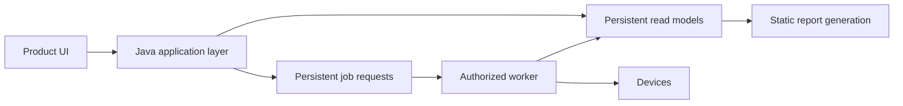

# UI 2.0 — council review record and second-opinion brief

## Status

**REVIEW RECORD — not a decision, not implementation authority.** Produced
2026-09-09 in the Product Owner's engineering session (the standing
in-session PO precedent) as the second step of
`docs/design/UI2_0_ARCHITECTURE_DESIGN.md` §14: PO review → **this record and
an external second opinion** → a `DECIDE` episode on the freeze. It exists so
the external reviewer ("Astra") and the later `DECIDE` episode start from one
page: what the product is for, what was decided, what an independent
reasoning pass and five council seats would refuse, and which questions only
the Product Owner can answer.

Document under review: `docs/design/UI2_0_ARCHITECTURE_DESIGN.md` (DRAFT,
PR #160, movement `UI2_0_ARCHITECTURE_DESIGN_FABLE_HIGH`, relay/NXS-LOCAL-0047),
successor to `docs/design/UI2_0_ARCHITECTURE_REQUIREMENTS.md` (PR #140).

### Council round — honest disclosure (`GOV_PO_ROLE_MIGRATION.md` §7 step 5)

- Triggers held: (a) eight explicit contradictions with frozen/constitutional
  authority (`UA-1`…`UA-8`); (b) a freeze candidate introducing identity,
  credential, session, storage-schema and write (class 1 backup) boundaries;
  (c) size — the candidate bundles four separable products.
- Seats launched in one message, each as a fresh-context, read-only
  `nexus-council-seat` agent with its own brief and no access to this
  session's conversation: **Security Reviewer** (mandatory under (b)),
  **Senior Python Architect**, **Check Point / VSX Engineer**, **DevSecOps /
  Platform Engineer**, **UI/UX Product Designer**, **Technical Product
  Owner**.
- Five seats returned complete three-table answers. The **Technical Product
  Owner seat failed** mid-review on an API session-rate limit and was **not
  re-run** (credit discipline, Product Owner direction); its lens is covered
  only by the single-author reasoning in §3 and is marked as such.
- All seats and this session ran on the same model family (Claude); **no
  cross-model independence is claimed**. The council was invoked from the
  engineering session on the Product Owner's explicit in-session direction,
  not from a `nexus-po` episode — a recorded deviation from the skill's
  invocation rule, not a precedent.
- Transcript evidence: the seat transcripts live in this session's task
  output directory (`…/3c7f5012-77e3-42c4-8144-ee31065afac8/tasks/`), not in
  the repository; each seat listed every instruction it received verbatim so
  isolation can be audited from those files.
- §3 is a single-author self-critique written **before** any seat returned,
  and is described as such.

---

## 1. Purpose — what we are building and why

Today's console (`py main.py --console`) is an authenticated wrapper over
collection modules built to produce a static HTML/JSON export. Under real use
it broke (content on first load, breakage when a job ran) because that is
the shape it has: six unconditional `run_html_export` tail calls, eight
`*_ui.py` payload builders as the only read model, `output_root` files as
the inter-stage medium (`UI2_0_ARCHITECTURE_REQUIREMENTS.md` §2). It is a
demonstration surface.

The Product Owner's product goal is a **production-grade operator console a
real network security team runs daily**: onboard devices (discovery and
manual), pull configuration and inventory automatically after onboarding, run
compliance checks against a chosen benchmark, manage backups the way the team
already knows from Backbox (profiles, schedules, history, drift), watch
failover readiness, and trust every number on the screen. UI 2.0 is that
product's first real definition, and the Product Owner has judged it worth a
large, deliberate, **incremental** commitment: a separate application, a new
language stack (Java, corporate requirement), a real multi-admin
authentication model, and a real backup subsystem — rather than a patch on
the static-export console.

The bar every design choice is measured against (`UI2_0_ARCHITECTURE_DESIGN.md`
§1): *would a real operator trust and rely on this daily?* — honest state
always (`UNKNOWN` is an answer), actions safe by construction, no surprise
device contact, multi-operator by design, the Backbox operating model under
this product's evidence/identity/taxonomy laws, and every migrated feature
carrying its proof with it.

## 2. What we planned — the decisions as they stand

| id | Decision (Product Owner, 2026-09-09) | Where |
| --- | --- | --- |
| Operating model | **Two parallel tracks.** Line-1 (the existing Python feature line: M-series, PCP, CE, RB, OP) keeps shipping, indefinitely; UI 2.0 is a separate track. A feature is ported into UI 2.0 only after it is mature in Line-1, one feature at a time, never stop-the-world | design §3 |
| `C-1` | UI 2.0 is a **separate shell/application** with its own typed read API; `CON.0` §6 amended to "both surfaces read the same persisted projections", §3 bundler rule narrowed to the shared report bundle (replacement text drafted, `UA-1`/`UA-2`) | §4 |
| `C-2` | **RBAC is `D1`/`D7`, never menu-hiding**: every entry renders, every action shows its authorization outcome, the server refuses. Role model: action → role token (repo) → role binding (encrypted DB row) → AD group reference | §5 |
| `C-3` | **Backbox-style profile-based backup**: a profile is a versioned, four-eyes-approved ordered step sequence with expect-style gates; works for any device reachable over SSH/SFTP, including vendors with no native collector; device onboarding stays in the Registry; no static built-in backup method. Browser: state/readiness/history, profile selection, target selection, schedule intent. Execution: class 1 under the `RB.x` contracts, scheduler/CLI only. Phase 1 authoring = CLI/file import; Phase 2 browser editor needs an `AGENTS.md` amendment (`UA-5`) | §6 |
| `C-4` | **Concurrent multi-admin, single active session per identity** (takeover/refuse), LDAP/AD instead of OIDC, successor to `DEPLOY.1A`'s auth shape; `M14`'s decisions carried or amended one by one | §7 |
| `U-1` | **Full Java stack** for UI 2.0, reached per feature (F2 projected → F3 intent-routed → F4 shadow → F5 authoritative); Python stays the worker until a feature reaches F5. New features are written in Python now; conversion begins when UI 2.0 development starts | §3.2, §8 |
| `X-2` | **PostgreSQL** frozen as production storage engine; SQLite local; CAS/recovery blobs on the volume; **Oracle deferred, not rejected** (corporate default; revisit if mandated) | §9, `PCP_STORAGE_ENGINE_DECISION.md` |

Where Line-1 stands (2026-09-09): 22 PRs merged since 2026-09-08 (#140–#161)
including the requirements and design documents, CE.2 primitives (#154),
PCP.8 runbooks (#159), the DLP-scanner fixes (main's full regression is now
3182 passed / 27 skipped / 1 environment-only failure), credential profiles
(#146), event-signal intake slice 1 (#145), Postgres migrations + DML-only
role (#149). The **OP.1 failover plan compiler contract was FROZEN** today
(`op_degraded_verdict` = Option A) and its implementation slice, the
`cphaprob tablestat` evidence source and RB.5 (recovery readiness projection
+ UI module) are dispatched. A `P0` security finding is open and scheduled by
the Product Owner, not fixed: the older PAN runtime path sends credentials as
URL query parameters (`PAN_AUTH_TRANSPORT_CONVERGENCE_AUDIT.md`).

---

## 3. Independent reasoning (single author, this session, written before the seats returned)

**Keep as written:** §1's bar; the F0→F5 ladder with F4 shadow and "device
contact never doubles"; RBAC as `D1`/`D7` with three levels of indirection;
the closed step-kind expect engine with discard-raw, four-eyes, immutable
versions and run-by-reference; the schedule-edit intent as the strongest
browser action, refuse-never-clamp, enable-requires-connect-check; the
single-session table; "the Python test suite becomes the fixture table of the
Java port" plus a re-earned real-environment `MATCH`; the zero-cost Oracle
portability rules.

**Concerns raised on my own:**

1. **Freeze size.** Four separable products are bundled (shell/read API +
   projections; auth/sessions/RBAC; backup engine; Java stack + migration
   mechanics). One freeze with eight amendments is trigger (c) itself.
   Recommend two freezes: the *UI 2.0 platform contract* (§3, §4, §5, §7, §8,
   §9) and the *backup profile engine contract* (§6), which §14 already names
   as a separate `CONTRACT` movement.
2. **"Back up now" is absent from the browser.** For a Backbox-modelled
   product this is the most visible gap. The design's own §6.7 makes a
   schedule-edit the strongest browser action; a one-shot schedule is
   semantically "run now" executed by the scheduler — either a legitimate
   `D7`-gated, audited, mandatory-reason "run once" intent, or a loophole
   around "class 1 never on an HTTP surface". Decide explicitly.
3. **Phase 1 authoring is CLI/file only.** The Product Owner's stated need
   is authoring profiles for unknown devices *in the product*. Decide `UA-5`
   now, not after the skeleton.
4. **F1 entry = real-environment validated.** Correct, but CE.2, RB.3b and
   tablestat cannot enter UI 2.0 until the Product Owner runs hardware;
   choose the first UI 2.0 screens from features that already qualify
   (Registry/enrollment, HA readiness derivation, inventory/config
   projections).
5. **`main.py --worker` (F3) is an unscheduled Line-1 component** and the
   linchpin of the parallel tracks; it should be the first Line-1 `CONTRACT`
   after the freeze.
6. **Two privacy/posture decisions are taken inside the design** (persisted
   encrypted directory group references; a long-lived read-only directory
   service account). Defensible for a multi-admin server; the Product Owner
   must accept them explicitly against corporate directory policy.
7. **Oracle.** If the corporate mandate is real, jOOQ's Oracle dialect is a
   commercial licence; confirm with the DBA/procurement before the skeleton.
8. **Repository shape.** Same repository (`ui2/`), shared fixtures, one relay
   process, one privacy gate — at the cost of a second toolchain in CI.
9. **`DEPLOY.1` is real.** No server exists; UI 2.0's server shape must pass
   the `DEPLOY.1`/`1A` gates. If a server is found, the §14 skeleton can
   start on Docker there immediately.
10. **Two LDAP designs.** Resolve the parked `M14`/`M14L` question as a
    product question: keep `M14L` as a local-console design only, do not
    implement it before UI 2.0 §7; avoid two LDAP stacks.

---

## 4. Council synthesis

### 4.1 Supported consensus (two or more seats, or one seat plus §3, on the same point)

| id | Consensus | Held by |
| --- | --- | --- |
| K-1 | §5 (gate chain in one interceptor; `E3` never re-evaluated in `E4`; visible-but-refused actions; no client-side role concept) is sound as written | SR, UX, §3 |
| K-2 | "Back up now" absent from the browser is taxonomy-correct, but the *presentation* is unresolved: either a declared class 1 action rendered refused (today's console pattern) or no control with explanatory copy — a permanently refused control for every role breeds refusal fatigue | UX-D2, SR-C3, §3-2 |
| K-3 | §6.3's illustrative CP profile is **not** the frozen RB.3b sequence and must not ship as one: it invents `show backup status`/polling, discovers the artifact by listing and deletes that name (the exact §7.8 prohibition), uses pipes, and defines preconditions the engine (§7.7) must own. The shipped CP profile must be the collector's frozen tuple and order, or every non-gated string marked `UNKNOWN` | CP-D1…D4, SR-D2 |
| K-4 | `gate_review_ref` presence is not enough: the ref must resolve to a source-committed gate registry entry, step class must be derived from that record (never author-declared), the write-marker denylist applies to every `send`. Phase 2 browser authoring is unacceptable until this holds | SR-D1, CP-C3/CP-D1 |
| K-5 | F3's "`job_submissions` row (M4 shape, in PostgreSQL)" names a table that does not exist (M4 `job_submissions` is SQLite-only; the Postgres job table is `console_job`); `main.py --worker` does not exist; both need a named Line-1 contract + `DEV.4.6` migration before any F3 | PA-D2/D3, DO-D1, §3-5 |
| K-6 | Infrastructure the design assumes is not there: no Postgres service in any compose file, root image, no driver in the image, no `DEPLOY.1` server; two DDL owners (Python runner + Flyway) and Python startup `_ensure_schema` still present; the Python DSN is read from the plain environment without TLS. Record these as freeze preconditions/`§12` rows, not acceptance gates | DO-D2/D3/D4, §3-9 |
| K-7 | "Encrypted at rest under the application role's key" has no key source, custody or rotation; joins `recovery_offhost_key_custody` | SR-D8, DO-D8 |
| K-8 | "Same jar, three roles" weakens the frozen rule that only the worker holds device credentials: per-component secret sets, DB roles and volume mounts must be stated | SR-D9, DO-D7 |
| K-9 | Persisted encrypted group references and a read-only directory service account are corporate-policy decisions the Product Owner must accept explicitly (`UNKNOWN` from the repository) | SR-Q3, DO-Q3, §3-6 |
| K-10 | Same repository recommended; consequences: which CI job runs the JVM suite, privacy-gate suffix extension (`.java/.kts/.gradle/.ts/.sql/.properties`), a dependency-approval packet for ~9 new dependency families, and a rule that additive schema changes are minor (no cross-track gate) | PA-D7/Q1, DO-D5/D6/Q1, §3-8 |
| K-11 | The first F2 slice must use a concern with an existing PostgreSQL seam (or a new projection such as HA readiness); the Device Registry backend raises on `postgres` today and is a separately gated `PCP` §10 movement — otherwise the first UI 2.0 slice blocks on Line-1 storage work (the hidden stop-the-world) | PA-D4, §3-4 |

### 4.2 Material dissent left unresolved (with the seat that holds it)

| id | Seat | Claim | Resolves if |
| --- | --- | --- | --- |
| SR-D4 | Security Reviewer | Server-mode enrollment (`role:onboarding_admin`) contradicts frozen `CON.0` §4.1/§7 rule 11 ("server mode remains blocked until `DEPLOY.1A` supplies real OIDC/RBAC") — not listed among `UA-1`…`UA-8` | Add `UA-9` with replacement text, or a PO ruling that LDAP-group RBAC satisfies the `DEPLOY.1A` condition |
| SR-D3 | Security Reviewer | A class 1 profile can reference the full-privilege collection credential | Credential profiles typed by class (D4 backup-class); validation and `E7` refuse a non-backup credential on any `recovery-write` step |
| SR-D5 | Security Reviewer | `security_admin` can self-grant by binding a token to a group they belong to; no bootstrap path for the first binding | Four-eyes on binding create/revoke; refuse when the actor is in the target group; CLI-only bootstrap |
| SR-D6 | Security Reviewer | Scheduler-originated class 1 runs have no named actor for `E4` re-evaluation; a departed editor's schedule is the unattended-contact escalation `C-D7` feared | Define the actor (last schedule editor) and the lapse outcome (schedule auto-disabled, surfaced) |
| SR-D7 | Security Reviewer | Binding as the operator from a network-reachable login form is a failed-bind amplifier (AD lockout, username enumeration) | Per-source throttle before any bind; uniform error; no application-side per-identity lockout; documented AD lockout interaction |
| SR-D10 | Security Reviewer | 12-hex unkeyed fingerprint is reversible from a DN list yet not attributable by `security_admin` | PO decision: attributable (display name resolved at read time) or pseudonymous |
| CP-D3 | Check Point | `finally` delete with `record_and_continue` has no ineligibility latch; RB.3b AC-3 requires `CLEANUP_FAILED` to block the endpoint until cleared | Ledger outcomes `completed/failed/cleanup_failed` on `BackupRun`; `cleanup_failed` blocks at `E7`; write-dependent `finally` skipped when the write was never sent |
| CP-D5 | Check Point | No "no retry" for `recovery-write`; `role:operator` "retry" does not exclude class 1 | Engine contract with the three ledger rules; validator refuses retry on `recovery-write` |
| CP-D6 | Check Point | §6 is silent on VSX/ClusterXL: VS-scoped `device_id` must be refused; each cluster member is its own endpoint/artifact; Spark/Gaia Embedded unsupported by lifecycle classification | Assignment-time and `E7` refusals; artifact per member |
| CP-D7 | Check Point | A prompt-driven interactive shell (`reads until the prompt regex`) is a **new network-access pattern**; the validated CP transport is `exec_command` per channel and the Expert prompt shape is `UNKNOWN` from repository evidence | Decide exec-per-step (connect gate = auth + banner), or gate an interactive-shell transport with real-environment prompt evidence |
| CP-D8 | Check Point | `host_key_policy` as profile data could carry a non-strict value | Server-owned; validator accepts only `strict_known_hosts` |
| PA-D1 | Python Architect | "Device contact never doubles" (F4) has no mechanism: only `cp-config`/`recovery-*` accept targets; the coordinator enforces concurrency, not frequency; a Java shadow run cannot "replace" a plane-wide Python run on pilot targets | F4 entry for device-contacting features names the `PCP.6` seam for that collector as a precondition plus the routing component and the one-implementation-per-endpoint-per-window invariant |
| PA-D5 | Python Architect | Only part of a Python test suite is table-exportable (CE.2: 12 registration cases of 29; the rest are `monkeypatch` over call structure); "33 tests" is not derivable | Classify each test as exportable / re-expressed / not-portable; F5 proof lists re-expressed ones as Java-native tests |
| PA-D6 | Python Architect | `AG-J11`'s parity "triple" cites `AC-CS-39`, which names only two fields; the resolver is wired into neither `html_export` nor the console today, so the three-surface parity test has no Python side | Cite the clause defining `evidence_presentation` parity or narrow to the pair; make `AG-J11` conditional on the Line-1 movement that wires the resolver |
| UX-D1 | UI/UX | Two different `STALE`/`PARTIAL` meanings on one backup screen (readiness state vs evidence-age qualifier) with no distinct labels/copy | §6.8 names both labels and copy; an `AC-CS-27`-style gate for the backup screens |
| UX-D3 | UI/UX | Takeover/refuse asked up-front on every login; `SESSION_SUPERSEDED` delivered as a 401 on "the next request" may hit a background fetch in a SPA and lose a half-typed reason | Ask only after a 409 conflict; render supersession as a blocking full-page state with time and audit reference |
| UX-D4 | UI/UX | During F2/F3 coexistence an operator can see two `collected_at` values for one device (today's console reads `output_root`, UI 2.0 reads Postgres) | Coexistence rule: once a feature is F2+, today's module reads the same projection or is retired; every module shows an "as of / source" stamp |
| UX-D5 | UI/UX | Backup overview and Profiles have no named navigation root (`PO-NAV-2` promotion trigger for the reserved Recovery root) | §6.8 names the root per surface against `NAVIGATION_INFORMATION_ARCHITECTURE.md` §4.3/§6.4 |

Not dissented by any seat (sound as written): §5.1, §5.3, §6.4, §6.5, §6.6 rule
structure, §6.7, §6.10 Phase 1, §6.11 defaults, §7.4, §8.4, §9 portability
rules, §8.3 migration/packaging/build rows.

### 4.3 Questions only the Product Owner can answer (deduplicated)

1. **Freeze slicing.** One freeze, or two (platform contract vs backup
   profile engine contract)? (§3-1)
2. **"Back up now".** (a) declared class 1 action rendered refused, (b) no
   control with explanatory copy, or (c) a `D7`-gated, audited, mandatory-
   reason "run once" intent — and is (c) a taxonomy amendment? (UX-Q2, §3-2)
3. **Phase 2 browser profile editor.** Amend `AGENTS.md` (`UA-5`) now, only
   as *composition* from a source-committed command-gate registry (SR-Q4), or
   not at all?
4. **Shipped CP profile.** Literally the RB.3b collector's frozen sequence
   executed by the engine, or a re-gated re-expression? (CP-Q1)
5. **Operator-authored profiles for unknown platforms.** May they contain any
   `recovery-write` step before a gate record exists, or class 0 only?
   (CP-Q2)
6. **Transport.** Is a prompt-driven interactive SSH shell approved as a new
   network-access pattern, or is exec-per-step the rule? (CP-Q4)
7. **Server-mode enrollment vs `CON.0` §4.1.** Does LDAP-group RBAC satisfy
   the `DEPLOY.1A` precondition, or is `UA-9` required? (SR-Q1)
8. **Audit attribution.** Attributable (names resolvable by
   `security_admin`) or pseudonymous (fingerprint only)? (SR-Q2)
9. **Directory posture.** Accept persisted encrypted group references and a
   long-lived read-only directory service account under corporate directory
   policy? (SR-Q3, DO-Q3, §3-6)
10. **Scheduler actor.** Who is the actor of a scheduler-originated class 1
    run for `E4`, and what happens when their membership lapses? (SR-Q5)
11. **Key custody** for `role_bindings`/`actor_authz_state` encryption —
    where does it live? (SR-Q6, DO-D8)
12. **Repository and CI.** Same repository (`ui2/`)? Does the JVM suite run
    in `validate` on every PR, or under the "no automatic full regression"
    policy? (PA-Q1, DO-Q1)
13. **Schema ownership.** Which single tool owns the shared PostgreSQL
    schema (Python runner or Flyway), and is retiring Python startup DDL a
    precondition? (DO-Q2)
14. **Sequencing authority.** Do Line-1 movements that exist only to serve
    UI 2.0 (worker mode, registry Postgres backend, projection writers,
    conditional `run_html_export`) compete with the M-series, and who owns
    the order? (PA-Q2)
15. **First F4 candidates.** Offline-only (HA readiness, resolver) first, or
    device-contacting features that must wait for `PCP.6`? (PA-Q3)
16. **Skeleton timing.** Wait for `DEPLOY.1` server arrival, or build against
    local Testcontainers until then? (DO-Q5, §3-9)
17. **Platform facts** (`UNKNOWN` from the repository): distroless JDK 21 in
    the corporate registry; Testcontainers/Docker on CI runners; Gradle vs
    Maven standard; jOOQ Oracle licence acceptability. (DO-Q4, U-J1…U-J3)
18. **Login UX.** Takeover/refuse on every login or only after a conflict;
    retire today's console module per feature as soon as its UI 2.0 module
    ships (to avoid two freshness stamps)? (UX-Q1, UX-Q4)
19. **Backbox references.** Will screenshots arrive before the §6 `CONTRACT`
    movement, or do the §6.11 defaults stand for it? (UX-Q5)
20. **`M14` disposition.** Keep `M14L` as a local-console design only, not
    implemented before UI 2.0 §7? (§3-10)

---

## 5. Questions for the external second opinion (Astra)

Context to give: §1 (purpose), §2 (decisions), the design document itself,
and this record. Asked specifically, in order of leverage:

1. **Stack.** Spring Boot 3 + jOOQ + Flyway + UnboundID + Apache MINA SSHD +
   TypeScript SPA + Gradle for a corporate Java estate with Oracle as the
   default database: would you change any row of design §8.3, and is there a
   reason to prefer JPA for portability despite the auditability argument?
2. **Expect engine.** Design §6.3's closed step kinds (`connect`/`exec`/
   `poll`/`sftp_get`/`verify`/`finally`) with per-step regex gates and no
   branching: sufficient for the Backbox operating model, or does Backbox
   rely on behaviours this model forbids (interactive prompts, conditional
   branches, pagination handling)? Exec-per-step vs an interactive shell?
3. **Migration ladder.** F4 "shadow" where the Java executor *replaces* the
   Python run on pilot targets and parity is a fingerprint `MATCH`: sound, or
   is a dual-run comparison safer despite the device-contact budget cost?
4. **Sessions.** Single-active-session-per-identity with takeover/refuse:
   standard practice or friction for a 3-admin team? Asked at login or after
   conflict?
5. **Freeze shape.** Would you freeze the platform contract and the backup
   engine contract separately, and in which order would you ship the first
   two screens?
6. **Anything the council missed** that would make a daily operator distrust
   the product.

---

## 6. External second opinion — Astra's response (2026-09-09)

**Basis and honest disclosure (Astra's own framing, preserved):** Astra's
review is based on this record only — it did **not** independently read
`UI2_0_ARCHITECTURE_DESIGN.md` or the codebase, and could not run Fable in
its own session. The comparison below is therefore *this record's account of
the Fable design* vs. Astra's assessment, not a fresh two-model
cross-examination.

**Headline position:** supports two development lines, but **rejects** the
design's "Python develops indefinitely, Java ports mature features later"
shape as written — without a per-feature Python-closure rule, the Java
effort chases a permanently moving target. Does **not** recommend freezing
the whole document as one candidate; the size/coupling concern (§4.1 K-1,
`freeze size`) is independently reached, not prompted by this record.

### 6.1 Point-by-point divergence from the design record

| Topic | Design record's shape | Astra's position |
| --- | --- | --- |
| Two-line model | Python develops indefinitely; Java ports mature features | When a feature moves to Java, **development ownership moves with it**. Python needs a feature-by-feature closure rule, not indefinite parallel growth |
| UI integration vs. language migration | Bundled: F2→F5 ends in Java authority | Should be **two independent axes**: (1) is it reachable from persisted state / a UI job request — product integration; (2) does Python or Java execute it — runtime migration. A screen can be real-product-complete while still Python-executed |
| New features | Written in Python first (§3.2 rule 1) | Where Java infrastructure already exists for that concern, write **directly in Java**; writing every feature twice should not be a standing requirement |
| Backup scope | General-purpose profile engine (any SSH/SFTP device) is in scope early | Start with a **narrow, validated-platform** product flow; generalize afterward |
| F4 shadow | Java replaces Python on pilot targets; fingerprint `MATCH` is the proof | That is a **pilot rollout**, not a shadow comparison. Real parity needs the same recorded inputs replayed against both implementations, offline; **writes must not run twice** for comparison's sake; `MATCH` alone is an insufficient acceptance criterion (two implementations can share the same bug; independent expected outputs, missing-data cases, error classification and recovery behaviour must all be tested; retrying blindly in Python after a Java cutover is not a safe rollback either) |
| Authorization | Every menu visible; server refuses | Agrees the server-side check is correct; disputes that "every menu always visible" is a **security requirement** — calls it a UX preference, separable from the D1/D7 rule itself |
| Scheduled-job actor | Last editor proposed as the execution actor | Prefers separating **owner**, **approver**, and **execution identity** — a more standard enterprise-automation shape |
| Architecture freeze | Two decisions: platform, backup | Agrees with the split; adds: fix the **platform contract the first end-to-end flow actually needs** before freezing either broadly |

### 6.2 Root cause, as Astra names it

The static-export/single-user assumptions live in the *scripts* (HTML tail
calls, shared files, single-operator state), not in the language. A
line-by-line Java port can carry those same assumptions forward unchanged.
Astra's target shape:

Opening a screen never starts a device connection; the user explicitly
requests an action, the request is persisted, a worker executes it, the
result becomes readable — the static report is another consumer of the same
data. A modular Java application with separate worker processes is proposed
for the start (registry / inventory / compliance / backup as separate
responsibilities in code, not necessarily separate microservices); **device
credentials live only in the worker**, and that separation must be enforced
by deployment, network access, database privilege and secret access — not
by package naming convention alone.

**Astra's two-line management model**, offered as an alternative to §3's
Track A/Track B split:

- **Line-1**: maintenance of not-yet-migrated Python features, the changes
  they still need, and the decompositions that make the Java migration
  possible.
- **Line-2**: the Java product platform — migrating existing features and
  developing new features directly where the ground is ready.
- **Shared foundation**: versioned data/job contracts, shared conformance
  fixtures, one priority order.
- Short-lived branches in the **same repository** (agrees with `U-J4`'s
  recommendation); two development lines living apart for months turns every
  contract change and bugfix into a merge problem.
- **One development owner per feature.** Once inventory is accepted in Java,
  new inventory behaviour is developed in Java; the Python implementation is
  kept only for a defined fallback window. Without that handoff, "two lines"
  becomes two separate products over time.

**Astra's correction to the F0–F5 ladder** — two separate questions, not one
axis:

| Product integration | Execution migration |
| --- | --- |
| Is it readable from persistent data? | Is Python or Java executing it? |
| Can a job be safely requested from the UI? | Was behaviour compared on identical inputs? |
| Can the operator complete their daily task? | Was the Java pilot and its rollback path verified? |

Under this framing, a Java screen can serve a feature that still executes
through a temporary Python worker — the full-Java destination is preserved,
but the UI does not wait on every collector's rewrite.

### 6.3 What the council did not go deep enough on, in Astra's view: the job-execution contract

A job table alone is not sufficient. The design must have an explicit answer
to: *a worker sends the backup command to the device, then dies before the
result is written to the database — what does the second worker do?*
Automatic retry can start the same device operation twice. The job contract
must define: distinguishing a duplicate request, job ownership/leasing,
timeout, worker-loss handling, and an explicit "outcome unknown" state. An
API-level idempotency key is useful, but it does not make the **device-side
command** itself idempotent — these are different guarantees (cites AWS's
idempotent-API pattern as a useful reference for the distinction, not as an
implementation to copy). Separately: two admins editing the same schedule
need version control so the last save does not silently clobber the other —
named as one of the basic tests of being a genuinely multi-user product.

### 6.4 "Back up now" — disagrees with the design's framing

Does not accept describing the safety boundary as "never accepted over
HTTP." The UI can create an authorized, audited request; a worker still
performs the device operation. If the current taxonomy forbids this, that
is an explicit contract change to make — not something to reach indirectly
via a one-shot schedule (using a schedule to simulate "run now" blurs the
design rather than resolving the question the council already raised, K-2).

### 6.5 Profile engine — more conservative than the design

Would not promise "any SSH-reachable device is supported." Start with
validated device families and immutable profile versions; a browser editor
should first **compose already-approved steps**, with free command
authoring treated as a separate, later capability; an interactive shell
should be added only where a validated device genuinely needs one. A
branch-free step list may be sufficient for a narrow platform scope; Astra
does not accept it as sufficient for universal device support — prompt
behaviour, pagination, session context and post-error recovery all need
proof against real devices, matching council seat CP's CP-D7 concern
independently.

### 6.6 F4 shadow — sharper disagreement than the council's

A Java pilot replacing Python on real targets does not by itself prove
output equivalence. Proposes: first replay the same recorded, safe test
inputs through both implementations for a semantic comparison (offline,
no double writes for comparison's sake); only then run Java on a bounded
device set. Fingerprint `MATCH` alone is not a sufficient acceptance
criterion — both implementations can share the same defect; tests need
independently-derived expected outputs, missing-data cases, error
classification and recovery behaviour. Blind Python retry after a Java
cutover is not treated as a safe rollback either.

### 6.7 Identity — reopens three of the design's decisions

1. **AD does not require the application to bind LDAP directly.** An
   OIDC identity provider federated to AD (e.g. Keycloak, which supports
   both LDAP/AD federation and OIDC) could be evaluated first if the
   corporate estate already has one; if a direct LDAP bind is truly
   mandatory, record that as an explicit corporate constraint, not a
   default choice.
2. **Does not accept single-active-session as a default security win** —
   asks what threat "blocking two browser tabs for one operator" actually
   mitigates. If required at all, `takeover` should be asked only on an
   actual conflict, and ending a session must not leave an in-flight device
   operation in an ambiguous state.
3. **Would not bind a schedule permanently to its last editor** — separate
   owner, approver, and execution identity; on authorization loss, what
   stops (and that the result is not silently going unprotected) must be
   visible with a notification, not implicit.

### 6.8 Technology choices

Accepts the Java decision and the Spring base; would validate the
jOOQ/Flyway choice against the real database and corporate-support terms
specifically — jOOQ's Oracle dialect support is commercial-tier, and the
licence question needs resolving early (agrees with council DevSecOps
seat's `U-J3`); a JPA switch alone would not be treated as "solving" Oracle
portability, since data types, migrations and SQL behaviour still need
separate verification either way. One migration authority for the shared
schema is required; "we added a column, therefore it's compatible" is not
sufficient — old-Python/new-Java interoperability windows need their own
tests; do not assume PostgreSQL production behaviour is proven by SQLite
tests. If "everything is Java" extends to the UI implementation language
itself, the TypeScript SPA row should be revisited — proposes evaluating
Vaadin Flow (server-side UI logic bound to browser components) as an
alternative, while flagging that server-resident screen state needs a real
capacity/session-cost measurement against the first real screen before
being adopted, not assumed.

### 6.9 Astra's proposed build order

1. Fix the migration rules first: feature ownership, the Python-closure
   rule, shared contracts, and schema authority.
2. Ship the first real **read** flow: one feature whose data is already in
   PostgreSQL — last successful result per device, data age, last error.
   If the Registry's PostgreSQL blocker is not resolved yet, do not anchor
   the first screen to it (independently reaches council's K-11).
3. Ship the second screen as **job history**: the user can create a request
   and track progress/failure reason; prove the execution chain first with
   a low-risk collection job.
4. Fully migrate one feature to Java: comparison, pilot, rollback
   verification, and the development-ownership handoff, together.
5. Add the validated backup flow; then expand the profile editor and new
   device coverage.

Local PostgreSQL/Testcontainers can carry step 2 while waiting for a real
server; production acceptance still happens in a real deployment
environment. The open PAN credential-transport finding (P0, §2 above) should
be closed before that path is accepted for production, independent of the
UI 2.0 timeline.

### 6.10 The three objections Astra is taking back to Fable

1. What capacity/feature-handoff rule guarantees the Java migration queue
   shrinks while Python keeps growing indefinitely?
2. If a worker crashes after sending the device command but before the
   result is written, what mechanism prevents a second worker from
   starting the same device operation again?
3. Before the general-purpose backup engine is complete, what exactly is
   the first end-to-end product flow an operator uses daily?

**Astra will not sign off on a comprehensive freeze without concrete answers
to these three.** As first acceptance evidence, Astra asks for a scenario,
not a PR/test count: three admins working on the same device concurrently,
a worker dying mid-operation, and the product recovering safely while
showing correct state throughout.

---

## 7. Reconciliation and recommended path to the freeze (for the `DECIDE` episode)

Astra's position **agrees with and sharpens** council consensus K-1 (freeze
size), K-2 ("back up now" — Astra goes further: reopen the taxonomy question
directly, don't route around it via schedules), K-5/PA-D2/D3 (the job
contract is underspecified — Astra's crash-mid-operation scenario is the
concrete test case K-5 lacked), K-11/PA-D4 (don't anchor the first screen to
the blocked Registry-Postgres seam), CP-D7 (interactive-shell transport
needs real-device proof), and SR-D6/DO's identity concerns (scheduled-job
actor). It **goes beyond** the council on F4 (rejects `MATCH`-only as
sufficient; wants an offline replay comparison before any pilot) and
introduces two points no seat raised: the Python-closure rule (without which
Track A/Track B is not actually "parallel" — it is "Python forever, Java
behind") and the product-integration vs. execution-migration split to the
F-ladder (a screen can be real without being Java-executed yet).

1. Product Owner answers §4.3 items 1–9 plus Astra's three objections
   (§6.10) first — they change the document's text and, per Astra, are a
   precondition for any comprehensive freeze, not a parallel track.
2. Amend `UI2_0_ARCHITECTURE_DESIGN.md`:
   - Replace §3's Track A "indefinite" framing with an explicit per-feature
     Python-closure rule (ownership transfers with the port; a named
     fallback window; §6.1/§6.2 above) and split the F-ladder into the two
     independent axes Astra proposes (§6.2).
   - Replace the §6.3 sample with the RB.3b sequence (K-3); add the
     gate-registry resolution rule (K-4).
   - Write a real job-execution contract answering Astra's crash scenario
     (§6.3 above) — ownership/leasing, timeout, worker-loss, duplicate
     detection, `OUTCOME_UNKNOWN` — before naming the real job table and the
     worker contract (K-5).
   - Add schedule optimistic-concurrency/versioning (§6.3 above, two admins
     editing one schedule).
   - Add the infrastructure/preconditions rows (K-6), key custody (K-7),
     per-component secrets (K-8), `UA-9` or the PO ruling (SR-D4), the
     VSX/ClusterXL rules (CP-D6), the transport decision (CP-D7 / Astra
     §6.5 — validated-device-first, interactive shell only where proven
     necessary), and the UX items (UX-D1…D5).
   - Decide "back up now" as an explicit taxonomy amendment question (§6.4
     above), not a schedule workaround.
   - Revisit F4's acceptance criterion per Astra §6.6 (offline replay before
     pilot; `MATCH` insufficient alone).
   - Decouple owner / approver / execution identity for scheduled jobs
     (§6.7.3) instead of "last editor."
3. Freeze in two decisions, narrower than originally scoped: the **UI 2.0
   platform contract** covering only what the first end-to-end flow needs
   (Astra §6.9 steps 1–3: migration rules, one read screen, one job-request
   screen with the crash-safe job contract) — **not** the full §3/§4/§5/§7/
   §8/§9 sweep at once — and the **backup profile engine contract** (§6,
   narrowed per Astra §6.5 to validated platforms first).
4. First engineering movements, in order: (a) a Line-1 `CONTRACT` for the
   job-execution contract + `main.py --worker` + the real job table,
   answering Astra's crash scenario explicitly (K-5); (b) the UI 2.0
   skeleton limited to one read screen (K-11: a concern with an existing
   Postgres seam, not the blocked Registry) against Testcontainers or the
   `DEPLOY.1` server if found; (c) the job-history screen proving the
   execution chain end to end on a low-risk collection job, per Astra's
   step 3 — before any backup or Java-stack expansion work begins.

Tier for the `DECIDE` episode and both `CONTRACT` movements: `Sonnet 5,
extended thinking (high)`. This record required no higher tier than the
design it reviews.

---

## 8. Product Owner directive (2026-09-09, after Astra's second round) — Line-1 code is reference, not runtime

The Product Owner rejected, explicitly and in full, any direct reuse of the
existing Python feature scripts inside UI 2.0: not as a transitional worker,
not as "first shipped profiles", not as the executor behind a Java shell.
The scripts were written to feed static, task-specific pages; the shared
purpose has changed. A new collect-and-parse structure is to be built in the
new architecture, using the old scripts only as the source of vendor
knowledge.

Consequences, recorded here and worked out in
`docs/design/UI2_0_DEVELOPMENT_WORKFLOW.md`:

- §7 step 4(a) (`main.py --worker`, Python job-queue consumer) and the
  `F2`/`F3` rest states of the design's ladder are withdrawn; the worker and
  the collection engine are Java from B1.
- Astra's two-axis ladder (§6.2), Python-closure rule (§6.1) and offline
  replay comparison (§6.6) are resolved by construction: there is one
  runtime, and parity is proven against sanitized real-capture fixtures plus
  a PO-run validation.
- K-3 ("RB.3b sequence as the §6.3 sample") and K-11 ("first read screen
  from an existing Postgres seam") are re-framed: RB.3b's frozen command
  tuple and gate records become the *specification* of the CP Gaia backup
  capability; UI 2.0 owns its own schema from the first migration.
- `C6` now means the **capability extraction contract** (spec + fixture set
  per Line-1 collector), and the extraction inventory is the ordered queue.
- Astra's three objections (§6.10): 1 is moot (Line-1 stops growing
  features); 2 is answered once, in the Java job contract (`C2`); 3 is a Java
  read-collection job end to end (B1 step 6–9), not a backup.
- Correction to §6.9/§7 wording: "audit from the first mutation" was
  attributed to SR-D8/DO-D8, which are key-custody findings. It is a new
  finding, carried into `C1` under its own id.
- Karar 2 ("back up now" = taxonomy amendment, option B) is recorded as the
  proposed answer, pending the Product Owner's explicit confirmation.
